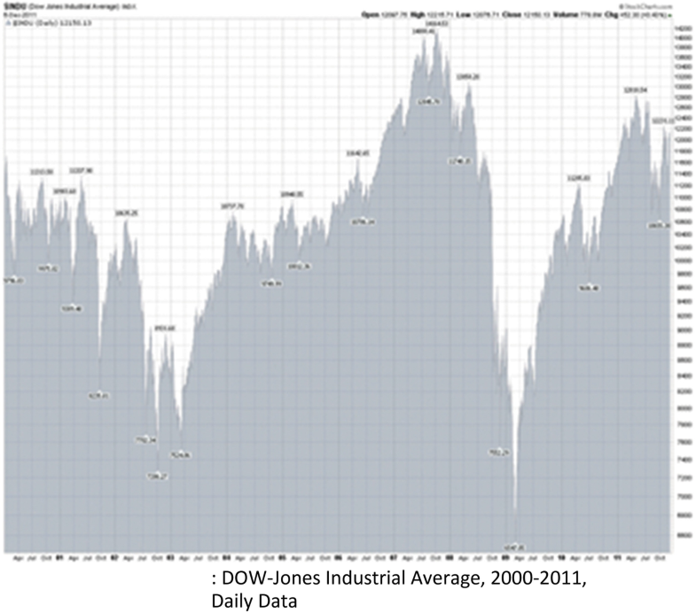

# Fundamentos de la economía conductual compleja {#FECC}

Herbert A. Simon desarrolló la idea de racionalidad limitada a partir de sus primeros trabajos (Simon 1947, 1955a, 1957), que se considera la base de la economía conductual moderna.. La economía del comportamiento contrasta con la economía más convencional en que no asume la racionalidad de la información completa por parte de los agentes económicos en su comportamiento. En este sentido, se basa en conocimientos sobre el comportamiento humano de otras disciplinas de las ciencias sociales como la psicología y la sociología, entre otras. Sin lugar a dudas, se pueden encontrar economistas anteriores que sostenían que la gente está motivada por algo más que una mera maximización egoísta. De hecho, desde los inicios de la economía con Aristóteles, quien puso las consideraciones económicas en un contexto de filosofía moral y conducta adecuada, a través del padre de la economía política, Adam Smith en su Teoría de los sentimientos morales.(1759), a economistas institucionales posteriores como Thorstein Veblen (1899) y Karl Polanyi (1944), quienes vieron la conducta económica de las personas como incrustada en contextos sociales y políticos más amplios. Sin embargo, fue Simon quien acuñó ambos términos y estableció la economía del comportamiento moderna.

## Resumen {-}

Herbert A. Simon desarrolló la idea de racionalidad limitada desde sus primeros trabajos (Simon1947, 1955a, 1957), que se considera la base de la economía del comportamiento moderna . La economía del comportamiento contrasta con la economía más convencional en que no asume la racionalidad de la información completa por parte de los agentes económicos en su comportamiento. En este sentido, se basa en conocimientos sobre el comportamiento humano de otras disciplinas de las ciencias sociales como la psicología y la sociología, entre otras. Sin lugar a dudas, se pueden encontrar economistas anteriores que sostenían que la gente está motivada por algo más que una mera maximización egoísta. De hecho, desde los inicios de la economía con Aristóteles, quien puso las consideraciones económicas en un contexto de filosofía moral y conducta adecuada, a través del padre de la economía política, Adam Smith en su Teoría de los sentimientos morales (1759), a economistas institucionales posteriores como Thorstein Veblen (1899) y Karl Polanyi (1944) que veían la conducta económica de las personas como incrustada en contextos sociales y políticos más amplios. Sin embargo, fue Simon quien acuñó ambos términos y estableció la economía del comportamiento moderna.

Las iniciativas de Simon llevaron a una oleada de actividad e investigación durante las siguientes décadas, muchas de las cuales se hicieron más influyentes en las escuelas de negocios y los programas de gestión a medida que la revolución de las expectativas racionales conquistó la mayor parte de la economía durante las décadas de 1970 y 1980. Asumir una racionalidad limitada por parte de los agentes económicos lo llevó al concepto de satisfacción , que si bien las personas no maximizan, se esfuerzan por lograr los objetivos establecidos dentro de las limitaciones. Esto se aceptó en las escuelas de negocios, ya que a los gerentes se les enseñó a lograr niveles de ganancias aceptables para los propietarios.

También surgió de su descubrimiento de la racionalidad limitada su interés en investigar más profundamente cómo las personas piensan y comprenden como parte de su toma de decisiones. Esto lo llevó a considerar cómo se podría estudiar esto mediante el uso de computadoras. Esto lo llevó a convertirse en uno de los fundadores del campo de la inteligencia artificial (Simon1969), y Simon en general es considerado como uno de los primeros líderes de la informática en general. Pero fue su preocupación por las implicaciones de la racionalidad limitada lo que lo llevó a este campo naciente.

Simon también se convertiría en una figura destacada en el desarrollo temprano de la teoría de la complejidad, particularmente de la teoría de la complejidad jerárquica (Simon 1962), aunque solo hizo un vínculo indirecto entre esto y la racionalidad acotada. Sin embargo, los teóricos de la complejidad modernos están mucho más dispuestos a ver un vínculo estrecho y directo entre la complejidad de un tipo u otro y la racionalidad limitada y, por lo tanto, también con la economía del comportamiento (Velupillai2019). 1 De hecho, la complejidad puede verse como una, si no la base fundamental, de por qué las personas tienen una racionalidad limitada. La complejidad se encuentra en el corazón mismo de la economía del comportamiento desde este punto de vista, y Simon trató de comprender cómo las personas deciden frente a una complejidad tan ineludible.

## Herbert Simon y la racionalidad limitada {-}

El difunto Herbert A. Simon es ampliamente considerado como el padre de la economía del comportamiento moderna , al menos fue su trabajo al que se aplicó por primera vez esta frase. También fue uno de los primeros teóricos de la economía de la complejidad, si no el padre per se, y también fue uno de los fundadores del estudio de la inteligencia artificial en la informática. De hecho, fue un erudito que publicó más de 900 artículos académicos en numerosas disciplinas, y aunque ganó el Premio Nobel de Economía en 1978 por su desarrollo del concepto de racionalidad limitada., su doctorado fue en administración pública y nunca estuvo en un departamento de economía. Debemos utilizar el término "moderno" antes que "economía del comportamiento" porque se puede considerar que bastantes economistas anteriores se centran en el comportamiento humano real, asumiendo que la gente no se comporta plenamente en lo que ahora llamaríamos una manera "económicamente racional" (Smith1759; Veblen1899).

En este punto debemos tener claro que con la "economía del comportamiento" no asumimos una visión similar a la de la "psicología del comportamiento" del tipo defendido o practicado por Pavlov o BF Skinner (1938). Este último no considera que el estudio de lo que está en la mente o la conciencia de las personas sea de utilidad o interés. Todo lo que importa es cómo se comportan, particularmente cómo responden para responder a los estímulos repetidos en su comportamiento. Esto es más parecido a la economía neoclásica estándar, que también pretende estudiar cómo se comporta la gente con poco interés en lo que sucede dentro de sus cabezas. La principal diferencia entre estos dos es que la economía convencional hace una fuerte suposición sobre lo que está sucediendo dentro de la mente de las personas: que están maximizando racionalmente las funciones de utilidad individuales derivadas de sus preferencias utilizando información completa. En contraste, la economía del comportamiento no asume que las personas sean completamente racionales y particularmente no asume que estén completamente informadas. Lo que está pasando dentro de sus cabezas es importante,economía de la felicidad (Easterlin2017) son temas legítimos para la economía del comportamiento.

En cualquier caso, desde el comienzo de su investigación con su pionera disertación de doctorado que salió como libro en 1947, Comportamiento administrativo y a través de importantes artículos y libros en la década de 1950 (Simon1955a, 1957), Simon consideraba que las personas estaban limitadas tanto en su conocimiento de los hechos como en su capacidad para calcular y resolver los problemas difíciles asociados con el cálculo de soluciones óptimas a los problemas. Se enfrentan a límites inevitables a su capacidad para tomar decisiones completamente racionales. Por lo tanto, las personas viven en un mundo de racionalidad limitada , 2 y fue esta comprensión lo que lo llevó al estudio de la inteligencia artificial en la informática como parte de su estudio de cómo piensan las personas en un mundo así (Simon1969).

Esto llevó a Simon al concepto de satisfacción . Las personas establecen objetivos que buscan alcanzar y luego no realizan más esfuerzos para mejorar las situaciones una vez que se han alcanzado estos objetivos, si es que lo están. Por lo tanto, una empresa no maximizará las ganancias, pero sus gerentes buscarán lograr un nivel aceptable de ganancias que mantendrá a los propietarios suficientemente felices. Esta idea de satisfacción se convirtió en la clave central del estudio conductual de la empresa (Cyert y March1963) y entró en la literatura sobre administración, donde probablemente se volvió más influyente que en la economía, durante bastante tiempo.

Algunos economistas, en particular Stigler (1961), han tomado la posición de Simon y han argumentado que en realidad es un partidario de la racionalidad económica total, pero solo agregan otro aspecto a optimizar, a saber, minimizar los costos de la información. La gente todavía está optimizando, pero tiene en cuenta los costes de la información. Sin embargo, el argumento de Stigler enfrenta un problema inevitable e ineludible: la gente no sabe ni puede saber cuáles son los costos totales de la información. En este sentido se enfrentan a un problema potencial de regresión infinita (Conlisk1996). Para conocer los costos de la información, deben determinar cuánto tiempo deben dedicar a este proceso de aprendizaje; deben aprender cuáles son los costos de aprender cuáles son los costos de la información. Esto luego conduce al siguiente problema de orden superior de aprender cuáles son los costos de aprender cuáles son los costos de la información, y esta regresión en principio no tiene fin. 3 Al final, deben usar el tipo de dispositivos heurísticos (o “regla empírica”) que Simon propone que las personas que enfrentan una racionalidad limitada deben usar para responder a la pregunta. La plena racionalidad es imposible, y la ubicuidad de la complejidad es una razón central por la que este es el caso.

Simón (1976) Distingue sustantivo racionalidad de procedimiento racionalidad. La primera es el tipo de racionalidad asumida tradicionalmente por la mayoría de los economistas en la que las personas pueden lograr una optimización total en su toma de decisiones. Esto último implica que seleccionen procedimientos o métodos mediante los cuales puedan "hacer lo mejor" en un mundo en el que esa optimización total es imposible, las heurísticas con las que se manejan en un mundo de racionalidad limitada. En este sentido, no es el caso de que Simon vea a las personas como completamente irracionales o locas. Tienen intereses y generalmente saben cuáles son y los persiguen. Sin embargo, están inevitablemente limitados en su capacidad para hacerlo plenamente, por lo que deben adoptar varios métodos esencialmente ad hoc para lograr sus objetivos satisfactorios.

Entre estas heurísticas que Simon defendía para lograr la racionalidad procesal estaban el ensayo y error, la imitación, el seguimiento de la autoridad, la búsqueda desmotivada y el seguimiento de corazonadas. Pingle y día (1996) utilizó experimentos para estudiar la efectividad relativa de cada uno de estos, ninguno de los cuales claramente puede lograr resultados completamente óptimos. Su conclusión fue que cada uno de estos puede ser útil para mejorar la toma de decisiones, sin embargo, ninguno de ellos es claramente superior a los demás. Es aconsejable que los agentes realicen varios de estos y se muevan de uno a otro en diferentes circunstancias, aunque, como se señaló anteriormente, puede ser difícil saber cuándo hacerlo y exactamente cómo hacerlo. 4

## Imitación e inestabilidad de los mercados {-}

Si bien esta lista de procedimientos que pueden respaldar una búsqueda estrictamente racional de la racionalidad procesal es razonable, un punto que no se ha señalado claramente es que un enfoque excesivo en uno de estos en lugar de otros puede generar problemas. Es evidente que seguir la autoridad puede generar problemas cuando la autoridad es defectuosa, como han demostrado muchos ejemplos desafortunados en la historia. Cualquiera de estos puede generar problemas si se sigue con demasiada intensidad, pero uno que ha jugado un papel particularmente desafortunado en los mercados es la imitación, a pesar de que es un método ampliamente utilizado por muchas personas con una larga historia de éxito evolutivo. El problema es particularmente agudo en los mercados de activos, donde la imitación puede generar burbujas especulativas que desestabilizan los mercados y pueden generar problemas mucho más amplios en la economía, como lo demuestra claramente la crisis de 2008.

Una extensa literatura (MacKay 1852; Baumol1957; Zeeman1974; Rosser Jr.1997) ha reconocido que, si bien los agentes que se centran en los valores fundamentales de los activos a largo plazo tienden a estabilizar los mercados vendiéndolos cuando sus precios superan estos fundamentales y comprando cuando están por debajo de ellos, los agentes que persiguen tendencias pueden desestabilizar los mercados comprando cuando los precios están subiendo, por lo que haciendo que suban más, y viceversa. Cuando aparece una tendencia de precios al alza, los perseguidores de tendencias obtendrán mejores rendimientos que los fundamentalistas y la imitación de aquellos que lo hagan bien llevará a los agentes que podrían haber seguido estrategias fundamentalistas estabilizadoras a seguir estrategias de persecución de tendencias desestabilizadoras, que tenderán a empujar el precio aún más hacia arriba. Y cuando una burbuja finalmente alcanza su punto máximo y comienza a caer, los cazadores de tendencias pueden bajar el precio más rápidamente a medida que se siguen unos a otros en un pánico de ventas.

Smith et al. (1988), con muchos estudios posteriores que apoyan esta observación. 5 Incluso en situaciones con un horizonte temporal finito y un pago claramente identificado que establece el valor fundamental del activo que se negocia, en mercados experimentales se ha demostrado repetidamente que aparecerán burbujas incluso en estos casos simplificados y bien definidos. La gente tiene una fuerte tendencia a especular y a seguirse unos a otros en una especulación tan desestabilizadora a través de la imitación. Los procedimientos que pueden respaldar la racionalidad procesal en un mundo de racionalidad limitada pueden conducir a malos resultados si se aplican con demasiada fuerza.

Observamos que tales patrones toman regularmente tres patrones diferentes. Una es que el precio suba a un pico y luego caiga abruptamente después de alcanzar el pico. Otra es que el precio suba a un pico y luego disminuya de una manera más gradual de una manera razonablemente simétrica. Finalmente, vemos burbujas subiendo a un pico, luego disminuyendo gradualmente por un tiempo, finalmente colapsando en un choque impulsado por el pánico. Manías, pánicos y bloqueos clásicos de Kindleberger (2001) muestra en su Apéndice B que de 47 burbujas especulativas históricas, cada una de las dos primeras tiene cinco ejemplos, mientras que el resto, la gran mayoría, sigue el patrón final, que requiere agentes heterogéneos que no son completamente racionales para que ocurra (Rosser Jr. 1997). Esto muestra que la complejidad está profundamente involucrada en la mayoría de las burbujas especulativas.

Los gráficos 2.1 , 2.2 y 2.3 muestran la trayectoria temporal de los precios de tres burbujas antes, durante e inmediatamente después de la crisis de 2008. Muestran los tres patrones descritos anteriormente, tomados de Rosser Jr. et al. (2012). La primera es para el petróleo, que alcanzó un máximo de 147 dólares por barril en julio de 2008, el precio nominal más alto jamás observado, y luego se desplomó con fuerza a poco más de 30 dólares por barril en noviembre siguiente. Parece que es más probable que los productos básicos sigan este patrón que otros activos (Ahmed et al.2014).

**Figura 2.1** Precios del petróleo, 2000-2011

**Figura 2.2** Precios de la vivienda en EE. UU., Índice de Case-Shiller, 1987–2013

**Figura 2.3** Patrón de precios del mercado de valores de EE. UU., 2000-2011

El segundo patrón fue seguido por la burbuja inmobiliaria, que alcanzó su punto máximo a mediados de 2006 según este gráfico, que muestra dos índices diferentes, el de 10 ciudades de Case-Shiller y el de 20 ciudades también. Mirando de cerca, se puede ver un poco de aspereza alrededor del pico que lo hace parecer casi como el tercer patrón, mientras que, de hecho, si uno mira los mercados de la vivienda en ciudades individuales, se ven como los postula este patrón, con esta aspereza a nivel nacional reflejando que diferentes ciudades alcanzaron su punto máximo en diferentes momentos, con una ronda final de ellas en enero de 2007 antes de que todas declinaran.

Históricamente, este tipo de patrón se ve a menudo con las burbujas del mercado inmobiliario. El declive más gradual que en los otros patrones, casi simétrico con el aumento, refleja ciertos fenómenos de comportamiento. Las personas se identifican de manera muy personal e intensa con sus hogares y, como resultado, tienden a no aceptar fácilmente que su hogar ha perdido valor cuando intentan venderlo durante una recesión. Como resultado, tienden a ofrecer precios demasiado altos y luego se niegan a bajarlos fácilmente cuando no venden. El resultado es una disminución más dramática en el volumen de ventas en la fase descendente en comparación con los otros patrones, ya que la gente se aferra y se niega a bajar los precios.

El tercer caso muestra el mercado de valores estadounidense como lo muestra el promedio Dow-Jones, que alcanzó su punto máximo en octubre de 2007, para luego colapsar en septiembre de 2008. Tales patrones parecen ser más comunes en los mercados de activos financieros. Tales patrones muestran heterogeneidad de agentes con diferentes patrones de imitación, un grupo más inteligente (o más afortunado) que sale antes en la cima, seguido de un grupo menos inteligente (o menos afortunado) que espera que el precio vuelva a subir, solo que entrar en pánico más tarde en masa por cualquier motivo.

Finalmente, la Figura 2.4 muestra cómo este patrón con su período de dificultades financieras (Minsky1972) se puede modelar en un modelo basado en agentes que tiene agentes que cambian de una estrategia a otra en función de sus éxitos relativos, aunque no instantáneamente (Gallegati et al. 2011). Este modelo se basa en ideas de Brock y Hommes (1997, 1998) que subyacen al llamado modelo bursátil de Santa Fe (Arthur et al. 1997b). Lo que desencadena el colapso retrasado son los agentes que se encuentran con restricciones financieras, como sucede cuando las personas deben cumplir con las llamadas de margen en los mercados de valores. La curva más alta muestra el patrón cuando los agentes se imitan entre sí con más fuerza, como en un modelo de mecánica estadística cuando hay una interacción más fuerte entre las partículas.

**Figura 2.4** Patrón de angustia financiera simulado

## Complejidad jerárquica y la cuestión del surgimiento {-}

Si bien podemos ver el descubrimiento de Herbert Simon de la racionalidad limitada como una afirmación indirecta de ser un "padre de la complejidad", su afirmación más directa, reconocida por Seth Lloyd en su famosa lista, es su artículo de 1962 para la American Philosophical Society sobre "The Architecture de Complejidad ". En este ensayo transdisciplinario se ocupa de todo, desde las jerarquías organizativas a través de las evolutivas hasta las que involucran "sistemas químico-físicos". Está muy preocupado por el problema de la descomponibilidad de los sistemas de orden superior en sistemas de nivel inferior, señalando que los de producción, como los de relojería, así como los organizativos, funcionan mejor cuando existe dicha descomponibilidad, que depende de la estabilidad y funcionalidad de los sistemas de nivel inferior. 6

Sin embargo, reconoce que muchos de estos sistemas implican una casi descomponibilidad , quizás una complejidad jerárquica equivalente a la racionalidad limitada. En la mayoría de ellos existen interacciones entre los subsistemas, dependiendo la evolución más amplia del sistema de fenómenos agregados. Simon ofrece el ejemplo de un edificio con muchas habitaciones. La temperatura en una habitación puede cambiar eso en otra, aunque sus temperaturas no converjan. Pero las temperaturas generales que están involucradas en estas interacciones están determinadas por la temperatura agregada de todo el edificio.

Simon también se ocupa de lo que muchos consideran el problema más fundamental que involucra la complejidad, a saber, el de la emergencia. Su discusión más seria sobre el surgimiento de niveles más altos de estructura jerárquica a partir de niveles más bajos involucra la evolución biológica, donde estos temas han sido discutidos más intensamente durante mucho tiempo. Argumenta que la forma en que surgieron estos niveles superiores no ha reflejado procesos teleológicos sino procesos estrictamente aleatorios. También argumenta que incluso en sistemas cerrados, no es necesario que haya cambios en la entropía en el agregado cuando los subsistemas emergen dentro de ese sistema. Pero también reconoce que los organismos son sistemas energéticamente abiertos, por lo que “no hay forma de deducir la dirección, y mucho menos la velocidad, de la evolución a partir de consideraciones termodinámicas clásicas” (Simon1962, pag. 8). Sin embargo, el desarrollo de formas intermedias estables es la clave para el surgimiento de formas aún más elevadas.

Simon no cita esta literatura más antigua, pero este tema fue central para la literatura británica "emergentista" que surgió del siglo XIX para convertirse en el discurso dominante en la década de 1920 con respecto a la historia más amplia de la evolución biológica, todo integrado dentro de una visión más amplia que encajaba. esto dentro del surgimiento de sistemas físicos y químicos desde partículas a través de moléculas a niveles tan superiores por encima de la evolución biológica en términos de conciencia humana, sistemas sociales y aún sistemas superiores (Lewes 1875; Morgan1923) Simon se ocupó de esta multiplicidad de procesos sin establecer su interconexión tan estrechamente como lo hicieron estas figuras anteriores. En la década de 1930 con la síntesis neodarwiniana (Fisher1930; Wright1931; Haldane1932), el énfasis volvió a un proceso darwiniano casi continuo de cambios graduales que surgen del nivel de cambios probabilísticos que surgen de mutaciones a nivel genético, con el gen como el foco último de la selección natural (Dawkins 1976; Rosser Jr.2011a, B).

Si bien Simon evitó abordar este tema de la emergencia en la evolución biológica en 1962, cuando la síntesis reduccionista neodarwiniana estaba en el nivel más alto de su influencia, pronto la visión de la emergencia reaparecería, basada en un proceso evolutivo multinivel (Crow 1955; Hamilton1964; Precio1970). Esto se desarrollaría aún más con el estudio de la dinámica no lineal y la complejidad en tales sistemas, con figuras como Stuart Kaufffmann (1993) y James Crutchfield (1994, 2003), quienes se basan en modelos computacionales para sus descripciones de la autoorganización en sistemas evolutivos biológicos.

Figura 2.5 de Crutchfield (2003, pag. 116) describe cómo una mutación de nivel genético inicial puede conducir a efectos emergentes en niveles más altos. En el lado derecho están los genotipos que se mueven hacia arriba de una cuenca de atracción a otra, mientras que en el lado izquierdo los fenotipos también lo hacen en un patrón paralelo. Introduce el concepto de mesoescalas para tales procesos, que siguen claramente la advertencia de Simon sobre la necesidad de que surjan sistemas intermedios estables para apoyar la aparición de otros de orden superior.

**Figura 2.5** Emergencia evolutiva

Este punto de vista sigue siendo cuestionado por muchos evolucionistas (Gould 2002). Si bien la tradición que atraviesa la teoría de la catástrofe de D'Arcy Thompson (1917) ha defendido durante mucho tiempo la forma que surge de estructuras profundas en la evolución orgánica, los críticos han argumentado que tales procesos de autoorganización son, en última instancia, procesos teleológicos que replican viejas perspectivas teológicas pre-evolutivas como la de Paley (1802) en el que todas las cosas están en su lugar, como debe ser debido a la voluntad divina. Otros han criticado que tales procesos carecen de principios de invariancia (McCauley2005). Otros argumentan una base más computacional para tales procesos (Moore1990). No hay una resolución fácil de este debate, e incluso aquellos que defienden la importancia de la autoorganización emergente reconocen el papel de la selección natural. Así, Kaufffmann (1993, pag. 644) ha declarado, “La evolución no es solo 'casualidad atrapada en un ala'. No es solo un retoque ad hoc, de bricolaje, de artilugio. Es un orden emergente honrado y perfeccionado por selección ".

Si bien los mecanismos no son los mismos, los problemas de la autoorganización emergente también se aplican a los sistemas socioeconómicos. El enfoque de Simon tendía a estar en las organizaciones y sus jerarquías. Si bien bien pudo haberse alineado con los sintetizadores neodarwinianos más tradicionales en lo que respecta al surgimiento de estructuras de orden superior en la evolución biológica, el papel de la conciencia humana dentro de los sistemas socioeconómicos humanos significa que las reglas son diferentes allí, y la formación de Las estructuras de orden superior pueden convertirse en una cuestión de voluntad y planificación conscientes, no mera aleatoriedad.

## Racionalidad limitada y aprender a creer en el caos {-}

Una de las mayores ironías con respecto a la racionalidad limitada es que fueron colegas de Herbert Simon en Carnegie-Mellon, particularmente John Muth (1961), quien desarrolló la idea de expectativas racionales mientras estudiaba las implicaciones de la racionalidad limitada. Muth, en particular, vio el supuesto de expectativas racionales como una solución a los problemas planteados por la racionalidad limitada. Sin embargo, Herbert Simon nunca tendría nada que ver con este desarrollo, viéndolo como un repudio a la racionalidad limitada. La idea de que la gente no solo sabe cuál es el verdadero modelo de la economía, sino que su visión subjetiva de la distribución de probabilidad del ruido exógeno en el sistema se corresponde con la distribución de probabilidad objetiva de dicho ruido, que también era convenientemente gaussiana, simplemente no era válida. aceptable en su opinión. Aparte de la incapacidad de los agentes racionales limitados para discernir el "verdadero modelo de la economía", nunca aceptaría la idea de que el ruido fuera gaussiano. Por supuesto,1955b), por lo que no se unió a sus colegas en su júbilo por el desarrollo de esta idea.

Dicho esto, en determinadas circunstancias puede suceder que los comportamientos heurísticos simples como regla empírica pueden funcionar bien en un mundo de dinámicas no lineales complejas para ayudar a los agentes racionales limitados a imitar dinámicas subyacentes que incluso pueden ser caóticas. Esto puede surgir si los agentes pueden lograr expectativas consistentes o CEE (Hommes y Sorger1998), una idea derivada del trabajo de Grandmont (1998) que se había hecho antes, a pesar de que solo se publicó el mismo año que el suyo. Un ejemplo de esto fue estudiado por Hommes y Rosser Jr. (2001) para la dinámica de las pesquerías cuando estas pueden presentar patrones caóticos. Tales patrones pueden surgir debido a la tendencia de las pesquerías a exhibir curvas de oferta que se inclinan hacia atrás debido a los límites de capacidad de carga de la mayoría de las pesquerías. Cuando los precios superan cierto nivel que es consistente con el rendimiento máximo sostenido, la cantidad de pescado disminuirá y se capturará menos.

De Rosser Jr. (2001b), X es la biomasa de los peces en la pesquería, siendo F ( X ) la tasa de crecimiento de X , que a su vez es igual a los rendimientos de cosecha en estado estacionario de la pesquería, h , que a su vez es igual a Q en el diagrama de oferta-demanda en la parte superior derecha de la figura. La porción bionómica está en la parte inferior derecha del diagrama y refleja un Schaeffer (1957) función de rendimiento, siendo r la tasa de crecimiento natural ilimitado de la población de peces y K la capacidad de carga de la pesquería:

$$Q=h=F(X)=r X(1--X / K)$$

Esta logística es bien conocida por ser capaz de exhibir dinámicas caóticas cuando de forma discreta a partir del trabajo de May (1976). Siguiendo a Gordon (1954) con E  = esfuerzo de captura medido por el tiempo que los barcos están fuera, q  = capturabilidad por barco por día, C  = costo, con costo marginal constante =  c , p  = precio del pescado y δ la tasa de descuento en el tiempo, entonces el costo viene dado por

$$C=c / q X$$

y la función básica de recolección puede ser dada por

$$h(X)=q E X$$

Sobre la base de Clark (1990), Hommes y Rosser Jr. (2001) derivó una curva de oferta completa que varía con δ . Esto se inclina hacia arriba para δ  = 0, acercándose asintóticamente al nivel de producción asociado con el rendimiento máximo sostenido, pero se dobla hacia atrás para δ  > 0.02, alcanzando una curva hacia atrás máxima en δ  = ∞, en cuyo punto la curva de oferta es idéntica al equilibrio de acceso abierto debido a Gordon1954) dada por

$$S(p)=r c / p q(1--c / p q H)$$

con curva de demanda lineal dada por

$$D(p)=A--B p$$

Hommes y Rosser Jr. (2001) describen la dinámica de la telaraña de una pesquería de este tipo bajo expectativas adaptativas por medio de una función discreta

$$P_{t}=\left[A--S_{\delta}\left(p_{t-1}\right)\right] / B$$

Hommes y Rosser Jr. (2001) muestran que esto puede ser caótico para valores dados de δ ya que S varía con él. Esto ocurrirá cuando S esté retrocediendo en esas porciones, lo que también puede conducir a resultados catastróficos a medida que cambia la demanda (Copes1970). 7

La cuestión de los pescadores racionales delimitados surge si les permitimos basar sus expectativas en una simple heurística, p e que representa el precio esperado, de un proceso autorregresivo de un período dado por

$$P^{e}(t)=\alpha+\beta\left(p_{t-1}-\alpha\right)$$

Este proceso AR (1) puede cambiar de acuerdo con el aprendizaje de autocorrelación de la muestra en el que los agentes a lo largo del tiempo ajustan los dos parámetros de control, α y β , en función del desempeño de los pescadores. Basado en el ECE y asumiendo que la dinámica caótica subyacente para la optimización de la pesquería viene dada por un mapa asimétrico de tiendas de campaña, Hommes y Rosser Jr. (2001) muestran que estos parámetros pueden converger en valores tales que esta simple heurística AR (1) reproducirá la dinámica caótica subyacente, que será una CEE.

Esto se muestra en la Fig.9 de Hommes y Rosser Jr. (2001), donde los pescadores comienzan capturando un nivel dado de X asumiendo una p constante , pero a medida que β en particular cambia inicialmente, aparece un movimiento de dos períodos, que luego se vuelve caótico después de que se produce el ajuste posterior de ambos parámetros. A este proceso se le ha llamado aprender a creer en el caosObservamos que esta dinámica permanece acotada como todas las dinámicas caóticas, evitando así un colapso catastrófico, un caso de caos que evita la catástrofe. Si bien esto replica en cierta medida las cifras estándar que muestran bifurcaciones que duplican el período hacia el caos, esta no es una de las que involucran la variación de un parámetro de crecimiento. Más bien se trata de un proceso de convergencia en un patrón de comportamiento basado en parámetros autorregresivos que se ajustan en tiempo real, no es lo mismo, incluso si se parece a él.

## Economía del comportamiento e incertidumbre keynesiana {-}

Herbert Simon evitó en gran medida abordar directamente las implicaciones macroeconómicas de sus ideas, más allá de expresar su desaprobación de la hipótesis de expectativas racionales que muchos afirmaban derivada de su trabajo, y esto incluso se afirmó como algo tan fundamental que era axiomático y no podía ser cuestionado por una teoría teórica profunda. y razones filosóficas, a pesar de su evidente y bien conocido incumplimiento de la realidad empírica, un punto del que Simon era plenamente consciente. Dado que su concepto de racionalidad limitada viola las expectativas racionales completas, y también la conexión profunda con la complejidad dinámica no lineal que se ha presentado anteriormente en este capítulo, aunque no tan completamente como podría haber sido, surge la pregunta, empujando más allá de la racionalidad limitada para la economía del comportamiento de manera más amplia,8 idea de incertidumbre fundamental?

La visión convencional es que en 1921 Frank Knight y John Maynard Keynes publicaron libros que establecían la distinción entre riesgo e incertidumbre , y Knight había acuñado claramente esta distinción, pero con el trabajo de Keynes explorando la distinción más profundamente al adoptar la misma terminología más tarde ( Keynes1936; Rosser Jr.2001a). El “riesgo” es cuantificable en términos de poder identificar una distribución de probabilidad que sea relevante para comprender un problema. “Incertidumbre” significa que no existe tal distribución de probabilidad identificable. A diferencia de Knight, Keynes era más consciente de la posibilidad de varias posibilidades intermedias que surgen de la incapacidad de estimar la medida cuantitativa por la disponibilidad de datos o por otras razones, además de reconocer la dificultad de separar una variedad de distribuciones de probabilidad posiblemente apropiadas. Este último es un tema que se ha debatido más intensamente, especialmente desde la crisis financiera de 2008, ya que el papel de la curtosis o “colas gordas” en los rendimientos financieros se ha vuelto más publicitado.

Observadores como Nassim Taleb (2010) Que distingue cisnes grises de cisnes negros .Las primeras involucran distribuciones de probabilidad que muestran colas gruesas y son conocidas, lo que potencialmente puede explicar resultados extremos en los mercados financieros y otras situaciones. Estos últimos involucran una verdadera incertidumbre keynesiana / knightiana, donde es imposible asignar una distribución de probabilidad, y donde los eventos descritos “surgen de la nada” sin ninguna posibilidad de pronosticarlos o esperarlos. Al respecto, Taleb argumentó que la crisis de 2008 fue un simple cisne gris, un desenlace extremo, que sin embargo obviamente estaba llegando y era esperado por cualquier observador razonable, en contraste con el desplome del mercado de valores del 19 de octubre de 1987, 22% para el promedio Dow-Jones, hasta el día de hoy, la mayor disminución de un día jamás, que no fue predicha por nadie y no tuvo una causa obvia, que "salió de la nada", y que fue un verdadero cisne negro,9

Rosser Jr. (1998, 2006) ha argumentado que la complejidad proporciona una base fundamental para la realidad de la incertidumbre fundamental. Paul Davidson (1996) ha argumentado que este no es el caso, que no solo la complejidad, sino nociones como la racionalidad limitada simoniana no son fundamentos propios o fundamentales de la incertidumbre fundamental. Distingue la incertidumbre ontológica de la epistemológica , argumentando que la verdadera incertidumbre keynesiana es la primera basada en la realidad de la no ergodicidad en la mayoría de las relaciones dinámicas en el mundo real (Davidson1982-83). Por el contrario, considera que la racionalidad limitada y las diversas variabilidades que surgen de la dinámica compleja no lineal son meramente epistemológicas. Si las personas tuvieran conocimientos y sistemas de predicción realmente precisos y precisos, podrían superar estas dificultades. El énfasis de Simon en las limitaciones del conocimiento y las limitaciones computacionales por parte de los individuos es objeto de especial escrutinio y crítica en este sentido. La base de la racionalidad limitada (y la complejidad) no es la incertidumbre fundamental, sino la mera incapacidad para calcular y saber. Si tan solo tuviéramos supercomputadoras con superconocimiento, todo estaría bien.

No existe una resolución definitiva de este debate, aunque debe tenerse en cuenta que una fuente importante de falta de ergodicidad dentro de muchos sistemas es la no linealidad de las relaciones dinámicas subyacentes que conduce a la complejidad. Pero como es bien sabido en el estudio econométrico de la dinámica caótica, es profundamente difícil distinguir la dinámica caótica determinista del ruido aleatorio (Dechert1996). Este debate se enfrenta a esta profunda incertidumbre propia.

Tal como está, mientras que la economía del comportamiento puede o no ser la base de la verdadera incertidumbre keynesiana / knightiana, cisnes negros talebianos, pero puede proporcionar una forma posible de lidiar con la política en un mundo sujeto a tal incertidumbre de cualquier fuente. Por lo tanto, aunque muchos macroeconomistas la ignoran de manera absurda, la de George Akerlof (2002) La macroeconomía del comportamiento casi con certeza está afectando fuertemente a los responsables de la formulación de políticas en la práctica, incluso si no hablan abiertamente de su influencia. Los banqueros centrales del mundo real y otros formuladores de políticas macroeconómicas están siguiendo patrones de comportamiento heurísticos como lo recomendó el fallecido Herbert A. Simon, incluso si pocos de ellos admitirán hacerlo.

## Economía del comportamiento y la complejidad de la evolución institucional {-}

El vínculo entre la economía institucional y la economía evolutiva se remonta al trabajo de Thorstein Veblen (1898). Es en gran parte en reconocimiento de este hecho que la primera organización en los Estados Unidos dedicada al estudio de la economía institucional se llama Association for Evolutionary Economics, 10 con nombres similares que se utilizan en otras naciones para dicho estudio, incluso en Japón (Shiozawa et al. Alabama.2019). Si bien no fue reconocido en ese momento y sigue siendo poco conocido, Veblen no solo pidió que la economía sea una ciencia evolutiva , sino que introdujo ciertas ideas que desde entonces han demostrado ser importantes para comprender la naturaleza de la complejidad en la economía, particularmente la de la causalidad acumulativa. , a menudo, 11 que muchos piensan que fueron introducidos más tarde por Allyn Young (1928) o Gunnar Myrdal (1957), y este último ha hecho que el término sea ampliamente conocido entre los economistas. Entre las diversas formas de complejidad que son relevantes para la economía, la causalidad acumulativa está más obviamente ligada a la complejidad dinámica , que conduce a rendimientos crecientes, equilibrios múltiples y una variedad de bifurcaciones en los sistemas dinámicos económicos. Sin embargo, se puede ver que también está relacionado con la complejidad computacional , el principal rival de la complejidad dinámica en el análisis económico.

Un tema importante para la cuestión de cómo la teoría evolutiva se relaciona con la economía institucional en su formulación temprana involucra las relaciones de Veblen con John R. Commons y Joseph Schumpeter. Veblen desarrolló ideas de la economía evolutiva darwiniana a principios del siglo XX en los Estados Unidos, mientras que Schumpeter es ampliamente visto como un firme partidario de un enfoque evolutivo del desarrollo económico, particularmente en lo que respecta a la evolución de la tecnología, incluso cuando criticó la economía institucional y la aplicación. de ideas biológicas (Rosser Jr. y Rosser2017). Tampoco es muy conocido, Commons (1924) también apoyaba una visión evolutiva, aunque tenía una perspectiva más teleológica sobre eso que Veblen o Schumpeter, quienes no veían la dirección necesaria para la evolución y el cambio tecnológico (Papageorgiou et al. 2013). Al tratar con un tema de complejidad, Schumpeter abogó firmemente por una visión discontinua o saltacionalista de la evolución (Schumpeter1934; Rosser Jr.1992), con el que Veblen estuvo de acuerdo con respecto al cambio tecnológico. Con respecto a la evolución institucional, Veblen la vio en su mayoría proceder de una manera más continua a través de la causalidad acumulativa, por lo que se acercó un poco más a Commons en ese asunto, incluso cuando argumentó que era fundamentalmente inestable y que experimentaría crisis y colapsos.

Un tema central para la economía institucional es la distinción entre instituciones y organizaciones (North 1990). Esto se vuelve central para el papel de la evolución en la economía, en particular, cuál es el meme que es el lugar de la selección natural evolutiva. En la literatura más antigua, el énfasis estaba más en las organizaciones, como con Commons (1934) que vieron organizaciones compitiendo entre sí, un tema también recogido por Alchian (1950), incluso cuando Commons enfatizó las estructuras más profundas de las instituciones en los sistemas legales. Mientras las organizaciones compiten, los economistas cada vez más evolucionistas se han centrado en las prácticas y rutinas como los memes más cruciales, siendo este un tema especial entre los seguidores neo-schumpeterianos como Nelson y Winter (mil novecientos ochenta y dos).

Un elemento importante de los procesos evolutivos es el surgimiento de estructuras de nivel superior a partir de estructuras de nivel inferior y más simples. Esto es más obvio en términos de organizaciones, pero en la evolución institucional el papel de los memes se vuelve crucial. Esto encaja con el tema de la evolución multinivel, controvertido durante mucho tiempo en la teoría de la evolución (Heinrich2004). Dentro de los sistemas humanos, esto se vincula a la cooperación, con Ostrom (1990) desarrollando cómo esa cooperación puede surgir a través de instituciones particulares. Este proceso de emergencia está ligado a conceptos profundos de complejidad, con Simon (1962) un desarrollador crucial de esta línea de pensamiento.

La comprensión de la compleja dinámica de la evolución institucional puede generar una posible reconciliación o incluso una síntesis entre la vieja y la nueva economía institucional. Coase (1937) reconoció que Commons originó la idea de la importancia de los costos de transacción, la pieza central de la nueva economía institucional (Williamson 1985). Mikami (2011) que ha argumentado que el esfuerzo por minimizar el costo de las transacciones puede conducir a una dinámica evolutiva compleja. Esto puede involucrar la causalidad acumulativa de Veblen, reconociendo cómo esto puede vincularse a una emergencia evolutiva compleja.

En el momento en que Thorstein Veblen estaba escribiendo sus obras más importantes, cuando el siglo XIX se convertía en el XX, no había una conciencia clara o general de lo que ahora llamamos complejidad , incluso aunque muchas ideas con las que ahora lo asociamos habían estado flotando en el mundo. varias disciplinas durante muchos años, especialmente en matemáticas e incluso algo en economía (Rosser Jr.2009b). No tenemos ninguna razón para creer que Veblen fuera particularmente consciente de estos aspectos, aunque la evolución misma se considera ahora como un proceso de complejidad por excelencia (Hodgson y Knudsen2006), que Veblen abogaría firmemente. 12 En cualquier caso, un aspecto central del enfoque de Veblen sobre la evolución económica fue su invocación de la idea de causalidad acumulativa , que fue el primero en introducir. 13 Debemos señalar que la causalidad acumulativa puede conducir a complejidades dinámicas a través de rendimientos crecientes, que Brian Arthur (1989, 1994) ha argumentado que es la clave central para comprender la complejidad, y que Veblen reconoció como presente en la tecnología industrial.

## El debate de la discontinuidad en la teoría evolutiva {-}

Fue Leibniz quien inicialmente acuñó la frase natura non facit saltum , o "la naturaleza no da un salto". Sería recogido por el propio Darwin quien lo repitió y lo aplicó a su teoría de la selección natural, y Marshall seguiría a Darwin al aplicarlo a la economía, repitiéndolo en los Prefacios de las ocho ediciones de sus Principios de Economía . Para Darwin (1859, págs. 166-167):

“Natura non facit saltum… ¿Por qué la naturaleza no debería dar un salto de estructura en estructura? En la teoría de la selección natural podemos entender claramente por qué no debería hacerlo: porque la selección natural sólo puede actuar aprovechando ligeras variaciones sucesivas; nunca puede dar un salto, sino que debe avanzar con los pasos más cortos y lentos ".

Esta fue una declaración contundente para Darwin dado que no entendía los fundamentos de cómo funcionaba el proceso de mutación a través de cambios en los genes, pero de hecho, muchos teóricos de la evolución desde Darwin han quedado impresionados por la idea de que solo pueden ocurrir cambios menores en los genes. en un momento para que las especies sean viables y sobrevivan y se reproduzcan, estableciendo así que al menos la mayoría de los procesos evolutivos sean lentos y graduales, como afirma Darwin. Sin embargo, hasta que la comprensión de la genética se integró completamente en la teoría darwiniana con la síntesis neodarwiniana en la década de 1930, hubo una mayor apertura para un cambio discontinuo más notable en la perspectiva lamarckiana que permitió la herencia de características adquiridas y, por lo tanto, más cambio evolutivo rápido.

Después de la década de 1930, la reafirmación más dramática de la posibilidad de un cambio rápido en forma de equilibrio puntuado vendría con Eldredge y Gould (1972), cuyos argumentos siguen siendo controvertidos entre los biólogos evolutivos. Sin embargo, la base de sus argumentos se estableció en el desarrollo de la síntesis neodarwiniana en sí durante la década de 1930, incluso si no fue claramente reconocida en ese momento. Una parte central de la síntesis neodawiniana, especialmente tal como la formuló Fisher (1930), implicaba centrarse en el gen, con la selección natural operando al nivel del gen, lo que contrastaba con las teorías que veían la selección natural operando a niveles más altos en totalidades. Los cambios en el nivel de un gen deben ser bastante pequeños para que sean viables, pero un método para estudiar esto a través de paisajes de aptitud como lo introdujo Sewall Wright (1932) abrió la puerta a una perspectiva más amplia, que puede trasladarse al estudio de la evolución institucional (Mueller 2015).

Una pieza de base siempre presente con respecto al marco del paisaje de aptitud de Wright que abrió la puerta a tales discontinuidades o puntuaciones saltacionalistas fue que Wright desde el principio permitió múltiples óptimos o equilibrios locales dentro de esos paisajes. Si bien él mismo no vio discontinuidades dramáticas en el nivel genético, reconoció que los cambios ambientales rápidos podrían cambiar los paisajes de modo que un antiguo pico podría convertirse con bastante rapidez en un valle y el pico más cercano al que se puede llegar por un gradiente podría estar a cierta distancia, lo que implicaría una evolución rápida, si no necesariamente discontinua en genotipo y fenotipo. 14 La Figura 2.6 muestra la descripción original de Wright de los paisajes de fitness y ciertos casos que podrían suceder (Wright1932, reproducido en Wright 1988, pag. 110), con el recuadro C que muestra el caso que se acaba de describir, un cambio de paisaje debido a algún cambio ambiental, que podría ocurrir de forma bastante repentina.

**Figura 2.6** Paisajes de fitness de Sewall Wright

Con respecto a la aplicación de estas ideas a la evolución económica y más específicamente a la evolución institucional, se acepta generalmente que si bien Marshall pudo haber estado de acuerdo con Leibniz y Darwin en que natura non facit saltum , Veblen tendió a aceptar la idea de que la evolución institucional podría ser discontinua, o en al menos, los equilibrios institucionales no eran estables y podían cambiar repentinamente. Así declaró (Veblen1919, pag. 242–243):

> “No sólo la conducta del individuo está rodeada y dirigida por sus relaciones habituales con sus compañeros del grupo, sino que estas relaciones, al ser de carácter institucional, varían a medida que varía el escenario institucional. Los deseos y anhelos, el fin y el fin, los caminos y los medios, la amplitud y deriva de la conducta del individuo son funciones de una variable institucional de carácter altamente complejo e inestable ”.

Curiosamente, aunque Schumpeter apoyó firmemente la idea del cambio tecnológico discontinuo y utilizó el lenguaje de la evolución en el contexto del desarrollo económico, rechazó el uso de analogías biológicas en tales discusiones, declarando que (Schumpeter 1954, pag. 789), "ninguna apelación a la biología sería de la más mínima utilidad". Descartó los mecanismos selectivos ya sean de tipo darwiniano o lamarckiano, usando la palabra "evolución" de una manera simplemente evolutiva (Hodgson1993a, B).

Si bien Wright no lo deletreó, una clave para la existencia de múltiples equilibrios locales en sus paisajes de fitness es la presencia de algún tipo de rendimientos crecientes. Esto trae a Arthur's (1994) énfasis en los rendimientos crecientes y su vínculo con la existencia de equilibrios múltiples y complejidad dinámica, 15 que se traslada a la evolución institucional. Minniti1995) utilizó una variación de Arthur et al. (1987) urn modelo para mostrar cómo pueden surgir equilibrios de delincuencia alta y baja en una sociedad, con interacciones sociales que proporcionan retroalimentaciones positivas como la clave para tal resultado, con posibles discontinuidades que surgen a medida que la cantidad de delincuencia puede cambiar muy repentinamente de un estado a otro. Esto se muestra en la figura 2.7, donde el eje horizontal es el porcentaje de la población que es delincuente, mientras que el eje vertical muestra la probabilidad de que un nuevo miembro de la sociedad sea un delincuente. Rosser Jr. y col. (2003b) aplicaron este modelo de economías informales en economías en transición, existiendo también equilibrios múltiples, como se aprecia en las grandes diferencias en esta variable entre las economías en transición de Europa del Este, con el grado de desigualdad jugando un papel importante como se analiza en el próximo capítulo.

**Figura 2.7** Equilibrios sociales múltiples

## Instituciones, organizaciones y el lugar de la evolución económica {-}

Si las economías son sistemas evolutivos, entonces la cuestión de cuál es el lugar de esa evolución es importante. Hodgson y Knudsen (2006) argumentan que hay tres características cruciales involucradas en la evolución verdaderamente darwiniana: variabilidad, selección natural y herencia. Para que algo califique como un locus de evolución, debe exhibir los tres. En la evolución biológica, el gen ciertamente cumple con todos estos: la mutación proporciona variabilidad aleatoria, la selección natural determina si un organismo que contiene un gen sobrevivirá o no, y los genes pasan de un organismo a otro a través de la reproducción si el organismo es capaz de sobrevivir y atraer parejas. para efectuar esto. Los críticos de la economía evolutiva argumentan que no existe una unidad o elemento definitivo en las economías que cumplan con los tres, incluso si muchos cumplen con algunos de ellos.

Dada la larga defensa de los seguidores institucionalistas de Veblen para hacer de la economía una ciencia evolutiva, estos temas han sido centrales en los debates dentro de esta área. El enfoque en las organizaciones ha atraído la atención durante mucho tiempo, y esto posiblemente sea más importante para Commons que para Veblen. Para Commons, la selección dirigida o artificial era más importante que la selección natural estrictamente aleatoria, y señaló que el propio Darwin pasó mucho tiempo discutiendo tanto la selección natural aleatoria como la reproducción artificial (Commons1934, pag. 657; Vanberg1997). 16 Commons consideraba que las organizaciones estaban sujetas a una dirección y, por lo tanto, objetos apropiados para este tipo de evolución dirigida, que tenía como objetivo el mejoramiento humano general. En su argumento a favor de la evolución como fuerza fundamental en microeconomía, Armen Alchian (1950) enfatizó la competencia de las empresas, y la supervivencia del más apto implica qué empresas pueden acercarse más a maximizar las ganancias, incluso si no saben con precisión cómo lo están haciendo, siendo las empresas claramente el lugar de la evolución.

Una crítica a la idea de que las empresas, o de manera más general, las organizaciones, que sirven como el lugar clave de la evolución en la economía, es que, si bien están sujetas a una variabilidad aleatoria a medida que experimentan los choques del sistema, la selección natural opera claramente en su competencia entre sí. , con empresas no rentables que no logran sobrevivir, la pieza que falta es la herencia. Las empresas y organizaciones no se reproducen esencialmente a sí mismas. Todo lo que hacen es sobrevivir, aunque pueden cambiar mientras lo hacen. Estos cambios pueden reflejar estas fuerzas evolutivas de la selección natural, pero el elemento hereditario de hacerlo debe estar operando en un nivel más bajo que el de la empresa u organización en sí.

La principal alternativa para servir como el meme evolutivo 17 son los hábitos o prácticas dentro de una organización. Si bien no se vieron impulsados ​​a este argumento al tratar de encajar la nueva economía institucional en un marco evolutivo per se, así es como North (1990) y Williamson (2000) definir instituciones. Son hábitos o prácticas, no organizaciones. Esto es también lo que Nelson y Winter (mil novecientos ochenta y dos) llegaron en su búsqueda de la clave de la economía evolutiva, aunque etiquetaron estos memes como "rutinas". Pero antes de cualquiera de estos y antes de Commons y su énfasis en las organizaciones, Veblen identificó los hábitos, incluidos los hábitos de pensamiento, como el lugar central de evolución en las instituciones económicas, declarando (Veblen1899, págs.190-191):

> “La situación de hoy da forma a las instituciones del mañana a través de un proceso coercitivo y selectivo, actuando sobre la visión habitual de las cosas de los hombres y, por lo tanto, alterando o fortaleciendo un punto de vista o una actitud mental transmitida desde el pasado”.

Dado que, como él mismo dijo, la conducta del individuo está “rodeada por sus relaciones habituales con sus compañeros del grupo”, con estas relaciones de “carácter institucional”, son los hábitos y las relaciones habituales las que están en la base de la evolución de la sociedad. instituciones, incluso si él ve estas instituciones como estructuras sociales de orden superior. Son los hábitos los que están en la base, y los hábitos pueden cambiar, dando lugar a nuevos hábitos que pueden ser heredados por las personas y organizaciones que los utilizan. 18

## Emergencia y evolución multinivel {-}

Entre las ideas más fuertemente asociadas con la complejidad está la de emergencia , que una entidad de orden superior surge de una de nivel inferior que no es simplemente la suma de las partes de la de nivel inferior, que la entidad emergente es algo cualitativamente diferente. Si bien la idea de que un todo es mayor que la suma de sus partes ha existido durante mucho tiempo, una formalización científica de la misma probablemente se deba a John Stuart Mill (1843) en sus discusiones de lógica en las que caracterizó situaciones en las que algo cualitativamente diferente de sus partes aparece como representación de leyes heteropáticas . Sus ejemplos originales involucraron la química, como la forma en que aparece la sal cuando se combina el sodio con el cloro, y la sal no se parece en nada a ninguno de los dos por separado. Lewes1875) aplicó el término emergencia a tales fenómenos. Esto condujo a la escuela de pensamiento "emergente británica" que, especialmente en la década de 1920 (Morgan1923) aplicaría este concepto a la evolución, en particular a problemas tales como cómo los organismos multicelulares surgen de los unicelulares. Se aplicaría a cómo los grupos sociales más grandes se organizarían para actuar juntos a partir de grupos separados previamente más pequeños, una idea claramente importante en la evolución de las instituciones (McLaughlin1992).

En la teoría de la evolución biológica, este punto de vista cayó en desgracia en la década de 1930 con el surgimiento de la síntesis neodarwiniana, que puso el foco en el gen como el locus de la evolución, el meme, como Dawkins (1976) lo etiquetó. La idea de que la selección natural se produjo en niveles superiores al gen, en el nivel de "totalidades" o grupos, fue rechazada específicamente (Williams1966). El contrario obvio a esto en la evolución biológica involucra a los insectos sociales (Wilson2012), en el que los individuos se subordinan al bien de la colonia, convirtiéndose la colonia en vehículo de evolución. La mayoría atribuye la comprensión matemática de cómo esto puede surgir al trabajo de Price (1970) y Hamilton (1964, 1972). Sin embargo, de hecho, la formalización original de este entendimiento en términos de selección dentro del grupo versus entre grupos se debió a Crow (1955).

Sea B w la regresión génica dentro del grupo sobre el valor de aptitud del rasgo definido por Wright (1951); B b sea ​​la regresión génica entre grupos al valor de aptitud; V w es la varianza entre los individuos dentro de un grupo y V b es la varianza entre las medias entre los grupos. Para un gen altruista, uno esperaría que B w sea ​​negativo (que el comportamiento dentro del grupo dañe al individuo), mientras que B b sería positivo (el comportamiento del individuo ayuda al grupo). A partir de esto, una condición suficiente para que el gen altruista aumente en frecuencia viene dada por

$$B_{\mathrm{b}} /\left(-B_{\mathrm{w}}\right)>V_{\mathrm{w}} / V_{\mathrm{b}}$$

Dentro de la biología se ha argumentado ampliamente que esta condición rara vez se cumple. Sin embargo, también se ha reconocido que parece ser válido para los insectos sociales, y como Wilson (2012) argumenta, esto implica que aunque solo una minoría de especies muestran esta característica, terminan constituyendo una gran porción de la biomasa animal en la tierra (especialmente si se incluye a los seres humanos en ese cálculo).

De hecho, esta formulación se puede trasladar a los humanos para resolver el problema de la cooperación frente a las trampas dentro del contexto de la teoría del juego del dilema del prisionero (Heinrich 2004). El problema específico para el ser humano pasa a ser el de reconocer quién es un cooperador y quién no dentro de los grupos sociales, siendo el hacerlo con éxito la condición para que se produzca la cooperación y una coordinación de mayor nivel. Considerar en detalle cómo esa cooperación puede surgir en numerosos contextos para tratar con recursos de propiedad común fue el enfoque central del trabajo de Ostrom (1990). En general, esto puede verse como una condición para el surgimiento de instituciones de nivel superior a partir de instituciones de nivel inferior. 19

Algo paralelo a esto es una formulación de emergencia en la evolución biológica debido a Eigen y Schuster (1979) conocido como hiperciclo , que implica la conservación y transmisión de información, vinculándolo más a formas computacionales de complejidad. "El sistema más simple que puede permitir la evolución de enlaces reproducibles" (Eigen y Schuster1979, pag. 87). Definen un umbral de contenido de información, que si se excede para un sistema conducirá a una degeneración de la información debido a una catástrofe de error . Por encima de una catástrofe de errores hay una "desintegración de la información debido a una acumulación constante de errores" (Eigen y Schuster1979, pag. 25).

Sea V m el número de símbolos, σ m  > 1 el grado de superioridad de la ventaja selectiva de la “copia maestra” y q m la calidad de la copia de símbolos. El umbral viene dado por

$$V_{\mathrm{m}}<\ln \sigma_{\mathrm{m}} /\left(1-q_{\mathrm{m}}\right)$$

Tal formación de hiperciclo ha sido simulada por Mosekilde et al. (1983), y el concepto ha sido aplicado a la evolución de las estructuras de mercado basadas en tasas diferenciales de aprendizaje entre empresas por Silverberg et al. (1988). También se ha relacionado con el concepto de autopoesis , definido como la reproducción estable de una estructura espacio-temporal (Varela et al.1974).

Esto puede verse como vinculado a la autoorganización tal como la formuló Turing (1952) en forma de morfogénesis . Cuando tal morfogénesis implica la emergencia a un nivel superior, se convierte en morfogénesis hipercíclica (Rosser Jr.1991, Cap. 6), o el momento anagenético de Rosser Jr. et al. (1994). Radzicki (1990) aplicó tales argumentos a la cuestión de la formación de instituciones a partir de dinámicas caóticas subyacentes. 20 Dentro de la evolución, el surgimiento de niveles jerárquicos superiores también fue el foco central de Simon (1962).

Esto plantea paralelos dentro de los modelos teóricos de juegos evolutivos del tema de la evolución multinivel (Heinrich2004), con las ecuaciones de Price-Hamilton proporcionando condiciones suficientes para que esto ocurra, aunque la versión original se debió a Crow (1955). Para su población, B w y B b son regresiones genéticas de aptitud dentro y entre grupos sobre el valor del rasgo, V w y V b son las varianzas genéticas dentro y entre grupos, con W la aptitud media de la población, luego

$$\Delta C=\left(B_{\mathrm{w}} V_{\mathrm{w}}+B_{\mathrm{b}} V_{\mathrm{b}}\right) / W$$

Esto permite una declaración de Hamilton (1972) condición para que un rasgo altruista aumente (el equivalente a la cooperación en un nivel superior) como

$$B_{\mathrm{w}} /\left(B_{\mathrm{b}-}-B_{\mathrm{w}}\right)<r_{,}$$

donde r es el coeficiente de relación de Sewall Wright (Crow y Aoki1984). El lado izquierdo se puede interpretar como una relación entre el costo de la aptitud y el beneficio menos la aptitud.

Otra línea de procesos evolutivos emergentes está asociada con la visión neo-schumpeteriana fuertemente asociada con Nelson y Winter (mil novecientos ochenta y dos) y su estudio de cuáles son los memes clave en la economía evolutiva. Son conocidos por defender la idea de que las rutinas son el meme clave que es el lugar de tales desarrollos evolutivos. Los mismos Nelson y Winter estaban menos enfocados en este asunto de los órdenes superiores emergentes que se convierten en el lugar de la evolución, pero algunos de sus seguidores han perseguido tales ideas. En particular ha sido el desarrollo de la idea de mesoeconomía por Dopfer et al. (2004), originalmente debido a Ng (1986). Este es un nivel de economía que es intermedio entre la microeconomía de la empresa donde presumiblemente operan principalmente los procesos de Nelson y Winter y el nivel de macroeconomía totalmente agregado. El nivel mesoeconómico es más a nivel de industria o sector donde un meme puede haberse difundido entre empresas dentro de un sector o incluso en un conjunto de sectores relacionados. Estos desarrollos pueden llevar a que ésta sea la parte más importante de la economía desde el punto de vista del crecimiento y el desarrollo evolutivo.

En términos de evolución institucional que opera en niveles más altos de estructuras emergentes, un partidario posiblemente sorprendente de este punto de vista es el economista austriaco Friedrich Hayek. Esto parecería estar asociado, al menos en parte, con su abierta aceptación de la complejidad (Hayek1967) y especialmente en conexión con esto el concepto de emergencia, que se remonta abiertamente a los emergentistas británicos de la década de 1920. Su apertura a esta línea de pensamiento provino de sus primeros trabajos en psicología que culminaron en su The Sensory Order (Hayek1952). En este trabajo, vio específicamente la conciencia humana como una propiedad emergente que surge del sistema nervioso y el cerebro (Lewis2012). Crucial en su formulación fue la influencia de la teoría de sistemas desarrollada por Ludwig von Bertalanffy (1950), quien a su vez fue influenciado por la cibernética de Norbert Wiener (1948), considerada por muchos como otra forma temprana de complejidad dinámica. Más profundamente detrás de la cibernética fue el desarrollo del "sistema universal de organizaciones" o tectología de AA Bogdanov (1925-29), posiblemente una forma de economía institucional evolutiva que enfatiza el surgimiento. 21

De hecho, Hayek (1988) en su trabajo final, The Fatal Conceit , aplicó su visión de la complejidad emergente que involucra la evolución en una forma de orden superior, con tales estructuras institucionales emergentes compitiendo entre sí y evolucionando como todos compitiendo entre sí y sobreviviendo o no a través de un proceso sistémico. seleccion natural. Algunos argumentarían que esta aceptación de la selección natural que opera en el nivel de totalidades sociales de orden superior constituía una contradicción con el individualismo metodológico de la escuela austriaca, aunque de hecho en esto se remonta a las ideas evolutivas del fundador de esa escuela, Carl Menger. (1923) que, al igual que Hayek, se desarrolló completamente al final de su carrera.

## Economía institucional antigua y nueva desde una perspectiva evolutiva compleja {-}

Los viejos y nuevos enfoques de la economía institucional han sido vistos durante mucho tiempo como en profundo conflicto, con el enfoque evolutivo derivado especialmente de Veblen del viejo punto de vista en conflicto con la mayor aceptación de la economía neoclásica afirmada por el nuevo, comenzando con Coase (1937). De hecho, fue Veblen quien inicialmente acuñó la frase "economía neoclásica", que usó de manera peyorativa para criticar el enfoque de equilibrio de Alfred Marshall y otros, por lo que la aceptación de Coase de este enfoque y el esfuerzo por encajar en él la nueva economía institucional parece ser un conflicto profundo difícil de superar. El vínculo entre la idea de Veblen de causalidad acumulativa y la teoría de la complejidad dinámica moderna parecería simplemente reforzar este desacuerdo entre los enfoques.

El concepto unificador central de la nueva economía institucional es el de costo de transacción y minimizarlo es el núcleo central de cómo se forman y se desarrollan las instituciones y organizaciones. Si una empresa subcontrata una actividad o la lleva a cabo dentro de sí misma, está determinado por cuál de estos minimizará sus costos de transacción, como argumentó inicialmente Coase (1937), con esto llevado adelante por Williamson (1985) y North (1990) en su formulación más explícita del nuevo enfoque de la economía institucional. Debemos señalar que Coase en particular, algo así como Schumpeter, rechazó específicamente la aplicación directa de ideas biológicas o evolutivas a su visión de la economía.

Incluso cuando Coase se opuso a la visión evolutiva de la vieja economía institucional de Veblen, reconoció vínculos con partes de sus opiniones. En particular, la idea de que los costos de transacción son importantes fue algo que obtuvo inicialmente de Commons (1934), y Williamson también reconoció más tarde esta fuente. Como ya se señaló, Commons adoptó una visión de la evolución institucional que enfatizaba su dirección y su sujeción a las decisiones humanas conscientes, al igual que con los criadores de animales estudiados por Darwin y Sewall Wright. Las instituciones pueden ser creadas conscientemente por personas sin que simplemente aparezcan o emerjan de algún misterioso proceso dinámico más allá del control humano. Mikami (2011) quien sostiene que incluso si a Coase no le gustaba la biología, sus puntos de vista simpatizan con la sociobiología y que el esfuerzo por minimizar los costos de transacción puede conducir a un proceso dinámico que es complejo.

## Resumiendo {-}

Herbert A. Simon fue el "padre de la economía del comportamiento" que formuló el concepto de racionalidad limitada a partir de eso. También fundó la noción jerárquica de complejidad que atraviesa los límites disciplinarios, lo que tiene implicaciones para el surgimiento evolutivo en estructuras de nivel superior en la naturaleza. Esto va más allá de la biología a una visión más amplia del universo, con un proceso evolutivo emergente que se extiende desde la aparición de átomos a partir de partículas subatómicas hasta la conciencia humana y más allá.

Para comprender la compleja evolución de las instituciones económicas es fundamental comprender plenamente las implicaciones de las ideas del fundador de la economía evolutiva y la economía institucional, Thorstein Veblen. Particularmente importante fue su formulación del concepto de causalidad acumulativa, que luego retomaron de manera más prominente figuras como Young, Myrdal y Kaldor. Esto se vincula con la teoría de la complejidad dinámica moderna a través de rendimientos crecientes, lo que conduce a múltiples equilibrios y dinámicas de desequilibrio complejas. La visión de Veblen era completamente darwinista en el sentido de que no propuso ninguna evolución teleológica dirigida de la manera que más favorecía el economista institucional John R. Commons.

De las ideas de Veblen sobre la evolución institucional surge también la posibilidad de la emergencia compleja de órdenes superiores de instituciones basadas en la cooperación, vinculadas a las ideas de Herbert Simon, así como basándose en la teoría de la evolución multinivel desarrollada por biólogos como Crow, Hamilton. , y el precio. La existencia y competencia entre instituciones económicas jerárquicas también implica problemas de complejidad computacional, nuevamente sin una dirección definida o un resultado probable. Esto revela las profundas relaciones entre la complejidad y la economía del comportamiento.

## Notas al pie {-}

1. Los problemas que surgen de la complejidad dinámica, como las discontinuidades repentinas y la dependencia sensible de las condiciones iniciales, implican una dificultad extrema para que los agentes se formen expectativas racionales con respecto a eventos futuros, mucho menos información completa y una racionalidad completa en su toma de decisiones. Otra fuente de sesgo es la inconsistencia temporal que implica el descuento hiperbólico (Gowdy et al.2013).
2. Podría decirse que Simon era paralelo en esto con Broadbent (1950), quien inició estudios sobre cómo los límites en la cognición conducen a la fatiga de la carga de trabajo.
3. Los planificadores centrales enfrentaron este problema en cuanto a cuánto tiempo y cómo dedican a pensar en cómo planificar. En la literatura francesa y rusa esto llegó a conocerse como planificación , el proceso de "planificar cómo planificar", aunque este término a veces se utilizaba para la planificación en general, así como para abordar el problema de la agregación de planes de nivel micro en macro coherente. unos (Rosser Jr. y Rosser,2018, pag. 11).
4. Se pueden encontrar estudios más detallados sobre este tema en Allen et al. (2011).

5 .
Este resultado contrasta con el trabajo anterior de Vernon Smith (1962) que muestra cómo con los mercados de doble subasta los mercados libres convergen rápidamente hacia los equilibrios.

6 .
Ver Rosser Jr. et al. (1994) para la discusión de diferentes formas de relaciones jerárquicas y emergencia. Rosser Jr. (2010b) proporciona una discusión sobre las relaciones entre multidisciplinar, interdisciplinario y transdisciplinario .

7 .
Rosser Jr. y Rosser (2006) consideran los problemas de la gestión de tales resultados catastróficos dentro de un marco institucionalista.

8 .
En contraste, la economía post-walrasiana (Colander, 2006) critica e intenta ir más allá del marco walrasiano, mientras que la economía poskeynesiana (también llamada "poskeynesiana") tiende a admirar las ideas de Keynes en diversos grados entre la variedad de escuelas de pensamiento poskeynesiano, con Harcourt y Kreisler (2013a, B) proporcionando una descripción general de estas escuelas.

9 .
No existe una separación definitiva de estos casos, ya que incluso las distribuciones gaussianas permiten resultados extremos, aunque con menos frecuencia que los que exhiben colas de grasa kurtótica. En Tom Stoppard's (1967) Rosencrantz y Guildentstern están muertos la secuencia de apertura tiene a los personajes finalmente condenados discutiendo sobre lanzar monedas cuando uno de ellos sigue lanzando cara "contra todo pronóstico" 92 veces seguidas, un resultado permitido por distribuciones de probabilidad donde la probabilidad de una cara es uno. la mitad por cada lanzamiento de moneda justa. Incluso Keynes aceptó ese resultado y señaló que las compañías de seguros obtienen ganancias al apostar en distribuciones de probabilidad identificables y medibles, incluso cuando defendió la incertidumbre fundamental para muchas situaciones.

10 .
En los EE. UU., Esta sociedad ha estado estrechamente asociada con la llamada "vieja economía institucional", mientras que puede ser que un enfoque evolutivo que tenga en cuenta la complejidad pueda unir los enfoques antiguos y nuevos.

11 .
Es un debate abierto si Veblen vio o no la causalidad acumulativa como necesariamente implicando economías de escala, aunque era consciente de la importancia de las economías de escala en los sistemas industriales (Veblen, 1919). Setterfield (1997) reconoce la prioridad de Veblen al introducir el concepto, pero sostiene que Young (1928) y Kaldor (1972) lo relacionó más claramente con el fenómeno de los rendimientos crecientes.

12 .
Veblen no fue el primer economista en defender la utilidad para la economía de la teoría evolutiva, y tanto Marx como Marshall lo hicieron antes que él, incluso cuando lo hicieron desde perspectivas muy diferentes. El factor más complicado en todo esto es el hecho de que el propio Darwin fue influenciado de manera crucial por el trabajo de Malthus sobre la población cuando desarrolló su teoría de la selección natural (Rosser Jr.,1992).

13 .
Que esto no es ampliamente conocido se puede ver en que Business Dictionary identifica al creador del término como Allyn Young (1928) [www.businessdictionary.com/definition/cumulative-causation.html] y Wikipedia identifica a su autor (en realidad, "causalidad acumulativa circular") como Gunnar Myrdal (1957) [ https://en.wikipedia.org/wiki/Circular_cumulative_causation ]. Ciertamente, el uso del término por Myrdal recibió una amplia atención.

14 .
Claramente, no existe un límite definitivo al observar lo que son datos esencialmente discretos entre lo que es continuo y lo discontinuo. En la evolución biológica, se observan diferentes individuos a través de generaciones y, con la excepción de gemelos o clones idénticos, el genotipo de cada individuo es discretamente distinto del de los demás. Del mismo modo, con los fenotipos, se podrían representar las posibles variaciones de una determinada característica física en una escala continua, pero los individuos seguirán teniendo diferencias discretas con otros individuos en tales características, incluso si son muy pequeñas. Por tanto, la distinción se vuelve arbitraria. En el nivel más bajo vemos una granularidad discontinua, pero en un nivel más alto, los defensores de la continuidad ven solo cambios graduales, especialmente en los promedios de población,2000a, Cap. 1, para un análisis más detallado de la distinción entre formas continuas y discontinuas).

15 .
La formulación original del modelo de Arthur fue de Arthur et al. (1987) y su estudio de las urnas Polya.

16 .
Curiosamente, Sewall Wright también se centró en la cría de animales debido a que trabajó para el Departamento de Agricultura de EE. UU. En la década de 1920, donde su pensamiento al respecto lo llevó a algunas de sus ideas, como la deriva aleatoria, también conocida como "el efecto Sewall Wright", a veces visto como una violación de la selección natural estricta en cómo se pueden formar nuevas especies, aunque la separación de subgrupos genéticamente distintos de una población puede ocurrir al azar en la naturaleza o mediante el control y la dirección consciente de los humanos como en la cría de animales.

17 .
El término "meme" como lugar de evolución se debe a Dawkins (1976), quien también propuso por primera vez la idea de "darwinismo universal".

18 .
Torgler estudia cómo la evolución de hábitos y normas determina el comportamiento fiscal en las sociedades (2016).

19 .
Sethi y Somanathan (1996) muestran que en tales juegos hay múltiples equilibrios de Nash, con algunos de apoyo y algunos de destrucción de los equilibrios cooperativos que son consistentes con el desarrollo sostenible. Rosser Jr. y Rosser (2006) amplían este argumento.

20 .
Algunos de los primeros modelos de formación de hiperciclo requirieron la ausencia de parásitos. Sin embargo, con una mezcla adecuada pueden ser estables frente a los parásitos (Boerlijst y Hogeweg,1991).

21 .
Véase también Stokes (1995).
