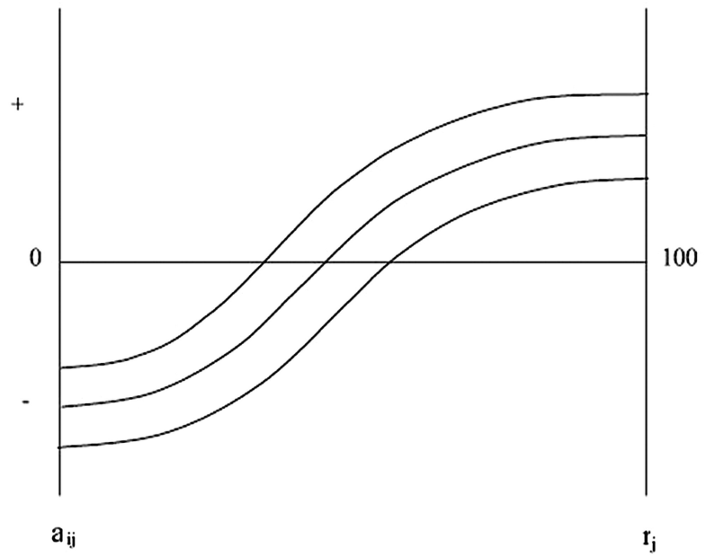
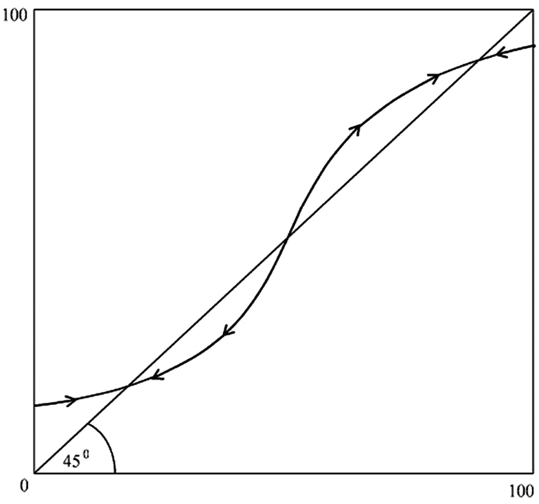

# (PART) Complejidad de las interacciones sociales {-}
# La compleja dinámica de las interacciones sociales {#LCDIS}

```{r, eval=knitr::opts_knit$get("rmarkdown.pandoc.to") == "html", results='asis', echo=FALSE}
cat('<hr style="background-color:#03193b;height:2px">')
```

Qué tan grande es la economía no observada (NOE) y qué determina su tamaño en diferentes países y regiones del mundo es una cuestión muy estudiada (Schneider y Enste, 2000, 2002). El tamaño de este sector en una economía tiene ramificaciones importantes. Afecta negativamente la capacidad de una nación para recaudar impuestos para apoyar a su sector público, lo que puede llevar a que más agentes económicos se muevan hacia el sector no observado (Johnson et al. 1997). Cuando este sector se asocia con actividades delictivas o corruptas, puede socavar el capital social y la cohesión social más amplia (Putnam et al. 1993), lo que puede dañar el crecimiento económico (Knack y Keefer, 1997; Zak y Knack, 2001). Además, dado que los programas de ayuda internacional están vinculados a medidas oficiales del tamaño de las economías, estas pueden verse distorsionadas por amplias variaciones en los tamaños relativos de la NOE entre diferentes países, especialmente entre las economías en desarrollo.

## Introducción {-}

Qué tan grande es la economía no observada (NOE) y qué determina su tamaño en diferentes países y regiones del mundo es una cuestión muy estudiada (Schneider y Enste, 2000, 2002). 1 El tamaño de este sector en una economía tiene ramificaciones importantes. Afecta negativamente la capacidad de una nación para recaudar impuestos para apoyar a su sector público, lo que puede llevar a que más agentes económicos se muevan hacia el sector no observado (Johnson et al.1997). Cuando este sector está asociado con actividades delictivas o corruptas, puede socavar el capital social y la cohesión social en general (Putnam et al.1993), lo que puede dañar el crecimiento económico (Knack y Keefer, 1997; Zak y Knack,2001). Además, dado que los programas de ayuda internacional están vinculados a medidas oficiales del tamaño de las economías, estas pueden verse distorsionadas por amplias variaciones en los tamaños relativos de la NOE entre diferentes países, especialmente entre las economías en desarrollo.

Los primeros estudios (Guttman, 1977; Feige,1979; Tanzi,1980, Frey y Pommerehne, 1984) enfatizó el papel de los altos impuestos y los grandes sistemas del estado de bienestar para empujar a las empresas y sus trabajadores hacia el sector no observado. Aunque algunos estudios más recientes han encontrado lo contrario, que impuestos más altos y gobiernos más grandes en realidad pueden estar relacionados negativamente con el tamaño de este sector (Friedman et al.2000), otros continúan encontrando la relación más tradicional (Schneider, 2002; Schneider y Klinglmair,2004). 2 Se ha encontrado que varios otros factores están relacionados con la ENO a nivel mundial, incluidos los grados de corrupción, los grados de sobrerregulación, la falta de un sistema legal creíble (Friedman et al.2000), el tamaño del sector rural y el grado de fragmentación étnica (Lassen, 2007).

Un factor que a menudo se ignora en esta combinación es la desigualdad de ingresos. Los primeros artículos publicados que tratan empíricamente de esta posible relación se centraron en esta relación dentro de las economías en transición (Rosser Jr. et al.2000, 2003b). 3 Para un grupo importante de economías en transición, encontraron una relación positiva fuerte y robusta entre la desigualdad de ingresos y el tamaño de la economía no observada. El primero de estos también encontró una relación positiva entre los cambios en estas dos variables durante el período inicial de transición, mientras que el segundo solo encontró que la relación de niveles aún se mantenía significativamente después de tener en cuenta varias otras variables. La otra variable significativa más importante fue una medida de inestabilidad macroeconómica, específicamente la tasa máxima anual de inflación que un país había experimentado durante la transición.

Aquí, la hipótesis de una relación entre el grado de desigualdad de ingresos y el tamaño de la economía no observada se extiende al conjunto de datos globales estudiado por Friedman et al. (2000). Se consideran variables macroeconómicas que no incluyeron y también un índice de confianza como medida de capital social. Una conclusión principal es que el hallazgo de estudios anteriores se traslada al conjunto de datos globales: la desigualdad de ingresos y el tamaño de la economía no observada poseen una correlación positiva fuerte, significativa y robusta. Ninguna otra variable aparece con una relación similar de manera uniforme, aunque un índice de corrupción sí lo hace para algunas especificaciones. Sin embargo, la inflación no está significativamente correlacionada para el conjunto de datos globales, en contraste con los hallazgos para los países en transición, y tampoco lo está el PIB per cápita. A diferencia de Friedman et al, las medidas de carga regulatoria y la falta de aplicación de los derechos de propiedad tienen una correlación negativa débil con el tamaño de la economía no observada, pero no de manera significativa. Sin embargo, la falta de observancia de los derechos de propiedad está fuertemente correlacionada negativamente con la corrupción, y la carga regulatoria también está bajo algunas especificaciones. El hallazgo de Friedman et al. (2000) que las tasas impositivas están correlacionadas negativamente con el tamaño de la economía no observada se mantiene solo de manera insignificante en regresiones múltiples.

Además, se consideran qué variables están correlacionadas en regresiones múltiples con la desigualdad de ingresos, los niveles de corrupción y la confianza. En una formulación general, las dos variables que se correlacionan significativamente con la desigualdad de ingresos son una relación positiva con el tamaño de la economía no observada y la carga regulatoria, con una relación negativa con tasas impositivas significativas al nivel del diez por ciento. En cuanto al índice de corrupción, las variables que se correlacionan significativamente con él son las relaciones negativas con la observancia de los derechos de propiedad y la confianza. La confianza está significativamente relacionada negativamente con la corrupción, pero contrariamente a la intuición está relacionada positivamente con el tamaño de la economía no observada, aunque su relación bivariada es negativa.

Más allá de estos hallazgos empíricos más específicos (y las implicaciones políticas relacionadas), hay una cuestión metodológica más general a considerar. Contribuye al paradigma emergente que enfatiza el papel de las interacciones sociales de agentes heterogéneos en sistemas económicos complejos como algo importante a considerar además del análisis más convencional que se enfoca únicamente en los incentivos individuales. Que una implicación tan clara del enfoque convencional como que los impuestos más altos deberían estar asociados con una mayor participación en la economía no observada puede ser anulada por el efecto de tales interacciones sociales es una fuerte evidencia de esta conclusión.

## Rendimientos laborales en la economía no observada {-}

Mientras que Friedman et al. (2000) se centran en las decisiones tomadas por los líderes empresariales, consideremos las decisiones tomadas por los trabajadores con respecto a qué sector de la economía desean suministrar mano de obra. Esto nos permite ver claramente el tema de las interacciones sociales involucradas en la formación de la economía no observada que tienden a quedar fuera en tales discusiones. Centrarse en las decisiones de los líderes empresariales no explica por qué la distribución del ingreso podría entrar en el asunto, y puede ser que el uso de este enfoque en mucha literatura anterior explique por qué los investigadores han evitado la hipótesis que consideramos tan convincente. Sin embargo, factores como el capital social y la cohesión social parecen estar relacionados con el grado de desigualdad de ingresos y, por lo tanto, deben reconocerse.

Necesitamos aclarar el uso de la terminología. Como se señaló en la nota al pie 1 anterior, la mayor parte de la literatura en este campo no ha distinguido entre términos como "informal, clandestino, ilegal, en la sombra", etc. al referirse a actividades económicas que no se informan a las autoridades gubernamentales (y por lo tanto no aparecen en las cuentas oficiales nacionales y del producto de la renta, aunque algunos gobiernos se esfuerzan por estimar algunas de estas actividades e incluirlas). En Rosser Jr. et al. (2000, 2003b) se utilizaron los términos “informal” y “no oficial”, respectivamente, y se argumentó que todas estas etiquetas significaban lo mismo. Sin embargo, debe reconocerse allí que existen diferentes tipos de actividades de este tipo y que tienen diferentes implicaciones sociales, económicas y políticas, algunas claramente indeseables y otras potencialmente deseables desde ciertas perspectivas, por ejemplo, empresas que solo pueden operar de esa manera. debido a una excesiva regulación de la economía (Asea,1996). 4

Rosser Jr. y col. (2007) utilizó el término “Economía No Observada” (NOE), que se utilizará aquí y que se introdujo en el Sistema de Cuentas Nacionales (SNA) de las Naciones Unidas en 1993 (Calzaroni y Rononi, 1999), y que se ha aceptado en los debates sobre políticas dentro de la OCDE (Blades y Roberts, 2002) y otras instituciones internacionales. El SNA subdivide a la NOE en tres categorías amplias: ilegal , clandestina e informal (Calzaroni y Rononi,1999). Hay más subdivisiones de estos con respecto a si su estado se debe a errores estadísticos, subregistro o falta de registro, que no discutiremos más.

El sector ilegal consiste en actividades que serían en sí mismas ilegales si se denunciaran oficialmente, por ejemplo, asesinatos, robos, sobornos, etc. Parte de la corrupción entra en esta categoría, pero no toda. En general, estas actividades se consideran inequívocamente indeseables desde el punto de vista social, económico y político. Las actividades subterráneas son aquellas que no son ilegales per se, pero que no se informan al gobierno para evitar impuestos o regulaciones. Por lo tanto, se vuelven ilegales, pero solo por esta falta de denuncia. Muchos de estos pueden ser deseables hasta cierto punto desde el punto de vista social y económico, incluso si no informar de ellos reduce los ingresos fiscales y puede contribuir a un entorno económico más corrupto. Finalmente, las actividades informales son aquellas que tienen lugar dentro de los hogares y no involucran intercambios de mercado por dinero. Por lo tanto, por definición, no entrarían en las cuentas nacionales de ingresos y productos, incluso si fueran declarados. En general, se cree que ocurren con mayor frecuencia en las zonas rurales de los países menos desarrollados y que son en gran medida beneficiosos social y económicamente. Aunque las implicaciones más amplias de estos diferentes tipos de actividad económica no observada varían considerablemente, todas dan como resultado que no se paguen impuestos al gobierno sobre ellas.

Aunque no es necesario para las relaciones positivas entre nuestras principales variables, la desigualdad de ingresos, la corrupción y el tamaño de la NOE, las condiciones bajo las cuales surgen los equilibrios múltiples como se discute en Rosser Jr. et al. (2003b) son de interés. Esta idea se basa en una considerable literatura, gran parte de ella en sociología y ciencias políticas, que enfatiza las retroalimentaciones positivas y los umbrales críticos en los sistemas que involucran interacciones sociales. Schelling (1978) en economía y Granovetter (1978) en sociología notó tales fenómenos, con Crane (1993) discutir casos que involucran conductas sociales negativas que se propagan rápidamente después de que se cruzan los umbrales críticos. Putnam y col. (1993) sugirió posibles equilibrios múltiples al discutir el contraste entre el norte y el sur de Italia en términos de capital social y desempeño económico. Aunque Putnam enfatiza la participación en actividades cívicas como clave para medir el capital social, otros se enfocan más en medidas de confianza generalizada, que se encuentra fuertemente correlacionada con el crecimiento económico a nivel nacional (Knack y Keefer,1997; Zak y Knack,2001; Svendsen,2002). Dado que Coleman (1990) define el capital social como la fuerza de los vínculos entre las personas en una sociedad, puede estar relacionado con la cohesión social y los costos de transacción potencialmente más bajos en la actividad económica.

El concepto de capital social es controvertido. Los primeros defensores de la idea incluyeron a Bourdieu (1977) y Loury (1977). Se pueden encontrar descripciones generales importantes en Woolcock (1998), Dasgupta (2000), Svendsen y Svendsen (2004), con Durlauf y Fafchamps (2005) proporcionando una perspectiva más crítica. Los últimos señalan que diferentes observadores proporcionan definiciones contradictorias del concepto con medidas y estimaciones econométricas confusas. Destacan especialmente el problema del “capital social negativo”, que los fuertes vínculos dentro de ciertos subgrupos, como la mafia, pueden ser contrarios al crecimiento económico. Putnam (2000) distingue entre capital social "puente" y capital social "vinculante". El primero consiste en vínculos en toda la sociedad en general, del tipo que presumiblemente reduce los costos de transacción de la actividad económica. Estos últimos son entre individuos dentro de un subgrupo de sociedad, el tipo que podría ser contrario al crecimiento económico general, aunque no necesariamente a los ingresos de los miembros del grupo y podría corresponder más al capital social negativo de Durlauf y Fafchamps. 5 Supondremos que las medidas de confianza generalizada sirven como sustitutos del capital social puente, más económicamente productivo.

Dasgupta (2000, págs. 395-396) proporciona tres conceptualizaciones alternativas a nivel agregado para la operación del capital social, que él identifica con la confianza. El primero lo tiene operando a través de la productividad total de los factores.

$$Y=A f\left(K_{1} A\right)$$

donde Y es la producción total, A es la productividad total de los factores, K es el capital físico agregado y N es la fuerza de trabajo. A es una función positiva del capital social puente, visto como una reducción de los costos de transacción a través de la confianza generalizada. Dasgupta encuentra que la evidencia de esto es débil, al menos para el este de Asia. El segundo enfoque distingue el capital humano, H, y lo ve influenciado junto con el capital físico por la reducción de los costos de transacción a través del capital social.

$$Y=A f(B(K, H), N)$$

donde B ahora captura las externalidades de red social del capital social. Dasgupta también informa para esto que la evidencia es débil de que B contribuya sustancialmente al crecimiento económico en los países de reciente industrialización. Finalmente Dasgupta postula que el capital social funciona tanto a través del capital humano como del trabajo a través de C ,

$$Y=A f(K, C N(H, N))$$

Dasgupta luego argumenta que no es posible distinguir claramente entre estas hipótesis. Sin embargo, aquí consideraré que ( 3.3 ) es la representación más apropiada y una consideración adicional supondrá que el elemento de externalidad social operará directamente a través de su impacto sobre el trabajo (no nos preocuparemos directamente por el capital físico).

Rosser Jr. y col. (2000, 2003b) argumentan que el vínculo entre la desigualdad de ingresos y el tamaño de la ENO es una relación causal bidireccional, que se ejecuta principalmente a través de rupturas de la cohesión social y el capital social. La desigualdad de ingresos conduce a la falta de estos, lo que a su vez conduce a una mayor tendencia a abandonar la economía observada debido a la alienación social. Zak y Feng (2003) encuentran más fáciles las transiciones a la democracia con una mayor igualdad. En sentido contrario, el gobierno más débil asociado con una gran NOE reduce los mecanismos redistributivos y tiende a agravar la desigualdad de ingresos. 6 Llevar la corrupción a esta relación simplemente la refuerza en ambas direcciones. Aunque nadie antes de Rosser Jr. et al. (2000) vincularon directamente la desigualdad de ingresos y el NOE, algunos lo hicieron de manera indirecta. Así, Knack y Keefer (1997) señaló que tanto la igualdad de ingresos como el capital social estaban vinculados al crecimiento económico y, por lo tanto, presumiblemente entre sí. Putnam (2000) muestra entre los estados de los Estados Unidos que el capital social está vinculado positivamente con la igualdad de ingresos, pero está vinculado negativamente con las tasas de criminalidad.

El argumento formal en Rosser Jr. et al. (2003b) se basó en un modelo de participación en la actividad mafiosa debido a Minniti (1995). Ese modelo, a su vez, se basó en ideas de retroalimentación positiva en modelos de urnas Polya debido a Arthur et al. (1987; ver también Arthur,1994). La idea básica es que los retornos al trabajo de participar en la actividad de la NOE aumentan durante un tiempo a medida que aumenta el tamaño relativo de la NOE y luego disminuyen más allá de cierto punto. Esto puede generar un umbral crítico que puede generar dos estados de equilibrio estable distintos, uno con un sector NOE pequeño y otro con un sector NOE grande. En el modelo de la actividad delictiva, el argumento es que la ley y el orden comienzan a romperse y luego se rompen sustancialmente en cierto punto, lo que coincide con una aceptabilidad social sustancialmente mayor de la actividad delictiva. Sin embargo, eventualmente se produce un efecto de saturación y los delincuentes simplemente compiten entre sí, lo que conduce a rendimientos decrecientes. Dado que dos de las principales formas de actividad NOE son ilegales por una razón u otra, se pueden imaginar tipos de dinámicas similares.

Sea N la fuerza laboral; N NOE sea la proporción de la fuerza de trabajo en el sector NOE; r j será el retorno esperado de la actividad laboral en el sector NOE menos el de trabajar en el sector observado para el individuo j , y a j será la diferencia debida únicamente a las características personales para el individuo j de los retornos del trabajo en el NOE menos los de trabajando en la economía observada, capturando tanto los efectos del capital humano como del capital social en el individuo. Supongamos que esta variable se distribuye uniformemente en el intervalo unitario, j  ∈ [0, 1], con una j aumentando comoj aumenta, que van desde un mínimo en una o y un máximo en un 1 . Además, esta diferencia de rendimiento entre los sectores sigue una función cúbica. Con todos los parámetros asumidos como positivos, esto da la vuelta al trabajo en el sector NOE para el individuo j como

$$r_{j}=a_{j}+\left(-\alpha N_{\text {noe }}^{3}+\beta N_{\text {noe }}{ }^{2}+\gamma N_{\text {noe }}\right)$$

con el término entre paréntesis en el lado derecho igual a f ( N μ ). La Figura 3.1 muestra esto para tres personas, cada una con una propensión personal diferente a trabajar en el sector NOE.

<center></center>
**Figura 3.1** Rendimientos relativos del trabajo en el sector no observado para tres individuos separados (eje vertical) como una función del porcentaje de la economía en el sector no observado (eje horizontal)

El equilibrio del mercado laboral más amplio se obtiene considerando la dinámica estocástica de la toma de decisiones de los potenciales nuevos trabajadores que ingresan. Sea N ′  =  N  + 1; q ( noe ) = probabilidad de que un nuevo participante potencial trabaje en el sector NOE, 1 -  q (noe) = probabilidad de que un nuevo participante potencial trabaje en el sector observado, con λ noe  = 1 con probabilidad q ( noe ) y λ noe  = 0 con probabilidad 1 -  q (noe). Esto implica que

$$q(n o e)=\left[a_{1}--f\left(N_{\text {noe }}\right)\right] /\left(a_{1}-a_{0}\right)$$

Por lo tanto, después del cambio en la fuerza laboral, la proporción de NOE será

$$N_{\text {noe }}^{\prime}=N_{\text {noe }}+(1 / N)\left[q(\text { noe })--N_{\text {noe }}\right]+(1 / N)\left[\lambda_{\text {noe }}-q(n 0 e)\right]$$

El tercer término de la derecha es el elemento estocástico y tiene un valor esperado de cero (Minniti, 1995, pag. 40). Si q (noe)>  N noe , entonces el valor esperado de N ′ noe  >  N noe . Esto implica la posibilidad de tres equilibrios, siendo los dos externos estables y el intermedio inestable. Esta situación se muestra en la Figura 3.2 .

<center></center>
**Figura 3.2** Probabilidad de que un nuevo participante en el mercado laboral trabaje en el sector no observado, q ( u ), (eje vertical) en función del porcentaje de mano de obra en el sector no observado (eje horizontal)

El argumento se puede resumir postulando que la ubicación del intervalo [ a 0 , a 1] aumenta con un aumento en el grado de desigualdad de ingresos, en el nivel de corrupción en la sociedad, o en un aumento en la brecha entre capital social puente y vinculante. Tal efecto tenderá a aumentar la probabilidad de que una economía esté en el equilibrio superior en lugar de en el equilibrio inferior y, si no se mueve de menor a mayor, se moverá a un valor de equilibrio más alto. En otras palabras, esperaríamos que una mayor desigualdad de ingresos o más corrupción resulten en una mayor proporción de la economía en la parte no observada. Sin embargo, al utilizar la confianza como principal indicador del capital social, la relación es ambigua, ya que dependerá del tipo de capital social que refleje. Si refleja un capital social puente, entonces esperaríamos que una mayor confianza conduzca a una menor actividad en la NOE,

Además, se puede esperar que haya interacciones mutuas entre varios de ellos. Se puede esperar que la economía no observada aumente la desigualdad al reducir los ingresos fiscales disponibles para la redistribución. También esperamos una fuerte retroalimentación de la misma a la corrupción, con todos estos potencialmente afectando el capital social de varias maneras.

Finalmente, se deben considerar otras variables que pueden interactuar con estas y entre sí, incluidos los factores institucionales, de política o macroeconómicos más amplios que se describen a continuación.

## Variables y fuentes de datos {-}

Aquí revisaré parte del análisis empírico de Rosser Jr. et al. (2007), en el que se consideran ocho variables: una medida de la participación del sector NOE en cada economía, una medida del índice de Gini del grado de desigualdad del ingreso en cada economía, un índice del grado de corrupción en cada economía, real per cápita ingresos en cada economía, tasas de inflación en cada economía, una medida de la carga fiscal en cada economía, una medida del cumplimiento de los derechos de propiedad, una medida del grado de regulación en cada economía y un grado de confianza generalizada. 7 Este conjunto de variables produjo ecuaciones para todas las variables dependientes con altos grados de significación estadística basadas en la prueba F. Los resultados para 1992-1993 y 2000 se estimaron utilizando estimaciones de MCO. Hay problemas para medir cada una de estas variables.

Sin duda, el más difícil de medir es la participación relativa de una economía que no se observa. La esencia del problema es que uno está tratando de observar lo que, en general, la gente no desea haber observado. Por lo tanto, existe una incertidumbre inherentemente sustancial con respecto a cualquier método o estimación, y hay mucha variación entre los diferentes métodos de estimación. Schneider y Enste (2000) proporcionan una discusión de los diversos métodos que se han utilizado. Sin embargo, argumentan que para las economías capitalistas de mercado desarrolladas, el método más confiable es el que se basa en el uso de estimaciones de la demanda de divisas. Se hace una estimación de la relación entre el PIB y la demanda de divisas en un período base, luego se miden las desviaciones de los pronósticos de este modelo. Este método, debido a Tanzi (1980), se utiliza ampliamente en muchos países de ingresos altos para medir la actividad delictiva en general. Dado que la mayoría de los modelos de demanda de divisas asumen que las tasas impositivas miden el efecto de la economía sumergida, esto complica su uso para probar esa variable. 8

Schneider y Enste recomiendan el uso de modelos de consumo de electricidad para economías en transición, un método originado por Lizzera (1979) debido a la inestabilidad de las relaciones financieras durante la transición económica. Kaufmann y Kaliberda (1996) y también Lackó (2000) han realizado tales estimaciones para las economías en transición, que proporcionan la base para el trabajo anterior de Rosser Jr. et al. (2003b). Las estimaciones de Kaufmann y Kaliberda tienen un método similar al de la demanda de moneda, excepto que se estima una relación entre el PIB y el uso de electricidad en un período base, y las desviaciones más tarde proporcionan la participación estimada de la NOE. El enfoque de Lackó difiere en que modela las relaciones de consumo de electricidad de los hogares en lugar del uso de electricidad a nivel agregado. Por supuesto, muchas formas de actividad económica clandestina no implican el uso de electricidad, y la tecnología de producción de electricidad puede cambiar con el tiempo y complicar tales estimaciones.

Otro enfoque es MIMIC, o indicador múltiple de causa múltiple, utilizado por primera vez en este contexto por Frey y Pommerehne (1984) y utilizado por Loayza (1996) para realizar estimaciones para varias economías latinoamericanas. Este método implica derivar la medida a partir de un conjunto de vínculos entre presuntas variables subyacentes y presuntos indicadores. Este método tiene el problema de que, en efecto, ya supone saber cuáles son las relaciones, por lo que se obtendrán resultados sesgados al probarlo en cualquiera de las presuntas variables subyacentes. 9

Un método más consiste en observar las discrepancias en los datos de las cuentas de producto y el ingreso nacional entre las estimaciones del PIB y las estimaciones del ingreso nacional. Schneider y Enste enumeran varios otros métodos que se han utilizado. Sin embargo, estos cuatro son los que subyacen a las cifras que utilizamos en nuestras estimaciones.

Si bien se utilizan algunas alternativas a algunas de sus otras variables, las medidas de la NOE que Friedman et al. (2000) se utilizan para las estimaciones de 1992-1993 que son más directamente comparables con su estudio. Estos, a su vez, se toman de tablas que aparecen en una versión anterior de Schneider y Enste (2000). Tienen 69 países enumerados y para muchos países proporcionan dos estimaciones diferentes. En general, para los países de la OCDE utilizan estimaciones de demanda de divisas, principalmente debido a Schneider (1997) o Williams y Windbeck (1995) o Bartlett (1990), con promedios de las estimaciones proporcionadas cuando hay más de uno disponible. Para las economías en transición se utilizan modelos de consumo de electricidad, principalmente de Kaufmann y Kaliberda, con algunos de Lackó. Los modelos de consumo de electricidad también se utilizan para las estimaciones más dispersas para África y Asia, y la mayoría de estas estimaciones se basan en el trabajo de Lackó, como se informa en Scheider y Enste. Para América Latina, la mayoría de las estimaciones provienen de Loayza (1996) que utilizó el método MIMIC. Sin embargo, para algunos países, los números de modelo de consumo de electricidad están disponibles, debido a Lackó y reportados por Schneider y Enste. Por último, el enfoque de discrepancia de las cuentas de ingresos y productos nacionales fue la fuente de un país, Croacia, también como se informa en Schneider y Enste. Aquí, la estimación se selecciona de las disponibles en función de los argumentos anteriores sobre cuál se esperaría que fuera más preciso. La mayoría de estas cifras corresponden a principios y mediados de la década de 1990.

Para 2000 números proporcionados por Schneider y Klinglmair (2004) son usados. Una parte sustancial de estos números se basan en la extensión DYMIMIC del método MIMIC. Esto dificulta la comparación de nuestros resultados para los dos puntos de datos diferentes y para cualquier estudio de relaciones dinámicas entre ellos, que generalmente mostraron resultados en su mayoría no significativos. 10 Desafortunadamente, hubo menos números de países disponibles para este año, y el conjunto consistió principalmente en los de la OCDE y las economías en transición. Esta variable se convirtió en la principal limitación para el conjunto de datos de 2000, que tenía solo 21 países para todas las variables.

Aunque no es tan difícil de medir como la NOE, la desigualdad de ingresos es una variable algo difícil de medir, con varios enfoques en competencia. El coeficiente de Gini es el número más ampliamente disponible en diferentes países, aunque no está disponible para todos los años en la mayoría de los países. Además, existen diferentes fuentes de datos que subyacen a las estimaciones de la misma, y ​​las encuestas en los países de ingresos más altos generalmente reflejan los ingresos, mientras que en los países más pobres a menudo reflejan solo patrones de consumo. Para la mayoría de los países en transición para 1992–93, las estimaciones elaboradas por Rosser Jr. et al. (2000) se utilizan, sin embargo, para los demás países se utilizan números proporcionados por el Informe de Desarrollo Humano de las Naciones Unidas para 2002 o 2003, que también corresponden a varios años de la década de 1990. De los 69 países estudiados en Friedman et al. (2000) hay tres para los que no se dispone de datos sobre el coeficiente de Gini: Argentina, Chipre y Hong Kong. Por tanto, no se incluyen en estas estimaciones.

La medida de corrupción es un índice utilizado por Friedman et al. (2000) que proviene de Transparencia Internacional (1998). Cabe señalar que la escala utilizada para este índice tiene un valor más alto para las naciones menos corruptas y varía de uno a diez. Esto contrasta con nuestros números de coeficiente de Gini y NOE, que aumentan con más NOE y más desigualdad. Por lo tanto, una relación positiva entre la corrupción y cualquiera de esas otras dos variables se mostrará como una relación negativa para nuestras variables. Para 2000 se utilizan números actualizados de la misma fuente.

Las cifras reales del PIB per cápita provienen del Informe de Desarrollo Humano de la ONU para 2001 y son para el año 2000. La tasa de inflación estimada es de la misma fuente pero es un promedio para el período 1990-2000. La medida de la carga tributaria proviene del Índice de Libertad Económica 2001 de Heritage Foundation (O'Driscoll Jr. et al.2001). Esto combina una estimación basada en la tasa impositiva marginal máxima sobre la renta, la tasa impositiva marginal que enfrenta el ciudadano medio y la tasa impositiva corporativa máxima y oscila entre uno (carga impositiva baja) y 5 (carga impositiva alta). Este número aumenta a medida que aumenta la carga fiscal. La medida de la aplicación de los derechos de propiedad proviene de O'Driscoll Jr. et al. (2001) y varía de uno (alto cumplimiento de los derechos de propiedad) a cinco (bajo cumplimiento de los derechos de propiedad). La medida de la carga regulatoria también es de O'Driscoll Jr. et al. (2001) y varía de uno (carga reglamentaria baja) a cinco (carga reglamentaria alta). Obviamente, hay una cantidad considerable de subjetividad involucrada en muchas de estas estimaciones. Después de tener en cuenta estas variables hasta ahora, el conjunto de datos utilizables se reduce de 69 a solo 52.

Finalmente, la medida de confianza para 1992-1993 es el índice utilizado en la Encuesta Mundial de Valores (Inglehart et al. 1998), que varía de cero a 100, y un valor más alto significa más confianza. Aunque estudian 43 “sociedades”, muchas de estas son subsecciones de las naciones que se observan aquí, como la ciudad de Moscú e Irlanda del Norte. Al final, cuando los números de este tipo se combinan con los enumerados anteriormente, solo quedan 32 de los 69 países originales, con el conjunto fuertemente dominado por la OCDE y los países en transición. Por lo tanto, con el fin de capturar una visión más amplia, se consideran regresiones con y sin la variable de confianza. Para 2000, los números utilizados para este índice fueron proporcionados personalmente por Ronald Inglehart, para el cual se dispuso de estimaciones anuales para muchos más países. 11

## Hallazgos empíricos {-}

Antes de las regresiones múltiples de MCO para los datos de 1992–93, la matriz de correlación para estas nueve variables generalmente presagia los resultados de la regresión, con algunas excepciones. Utilizando el conjunto más grande de 52 naciones sin confianza, para cada una de las otras tres variables dependientes principales, las variables independientes que resultan ser estadísticamente significativas en las regresiones MCO también tienen un valor absoluto alto en la matriz de correlación con la variable dependiente. Las dos excepciones son que la falta de aplicación de los derechos de propiedad y la carga regulatoria parecen estar fuertemente correlacionadas con el NOE, pero no así en la regresión múltiple. Pero sus relaciones con la corrupción son las correlaciones bivariadas más altas en la matriz, presagiando que la corrupción puede tener su efecto en algunas regresiones múltiples. El principal valor atípico se produce cuando aportamos confianza y el conjunto de datos se reduce a 32 países. La confianza está correlacionada negativamente con la NOE en la matriz de correlación, pero parece estar relacionada positivamente con ella en la regresión múltiple al nivel del diez por ciento.

En la regresión MCO sin la variable de confianza en la que la medida de la economía no observada es la variable dependiente y las otras siete variables son las independientes. El más significativo desde el punto de vista estadístico es el índice de corrupción, es decir, al nivel del 5 por ciento, siendo el más fuertemente correlacionado en la matriz de correlación. Se mantiene la relación positiva esperada entre estos dos (mostrada por un signo negativo). La otra variable significativa al nivel del 5 por ciento es el coeficiente de Gini. Los resultados cualitativos que se ven aquí se muestran consistentemente en otras regresiones con estas y otras variables en varias combinaciones.

Otro muestra la misma regresión pero con la variable confianza incluida como variable independiente y con el número de observaciones reducido en 20 debido a la indisponibilidad del índice de confianza para esos países. El índice de Gini sigue siendo significativo, incluso con más fuerza que en la regresión anterior. La corrupción ya no es significativa, aunque lo es casi al nivel del diez por ciento. Sin embargo, un resultado peculiar es que la confianza está relacionada positivamente con la NOE y significativamente al nivel del diez por ciento. Esto podría deberse a que el número de confianza está aumentando el capital social "vinculante" y "puente", posiblemente en consonancia con este resultado.

Siguiendo los argumentos de McCloskey y Ziliak (1996) el tamaño de los coeficientes para estas dos variables estadísticamente significativas es lo suficientemente grande como para ser también económicamente significativo. En la regresión más grande, las presuntas relaciones ceteris paribus serían que un aumento del 10 por ciento en el coeficiente de Gini estaría asociado con un aumento del 6 por ciento en la participación del PIB en la economía no observada, mientras que un aumento del 10 por ciento en la tasa de La corrupción (cambio en el valor del índice de un punto) estaría asociada con un aumento del 4 por ciento en la participación del PIB en la economía no observada. Estas son relaciones notables económicamente, aunque hay que tener cuidado al hacer extrapolaciones como estas. 12

Sin embargo, un hallazgo de las naciones en transición no se traslada al conjunto de datos globales. Esta es la relación estadísticamente significativa entre la inflación y el tamaño de la NOE, que incluso se trasladó al crecimiento de la NOE. Una posible explicación de esto es que durante el período de observación, las economías en transición experimentaron una inflación mucho más alta que la mayoría del resto del mundo, y Ucrania alcanzó una tasa anual máxima de más del 10,000 por ciento. Esta alta inflación estuvo fuertemente relacionada con el proceso general de colapso y colapso institucional que sucedió en esos países en ese momento.

Un hallazgo de Friedman et al. (2000) no se confirma, su conclusión de que la carga tributaria se correlaciona negativamente con el tamaño de la NOE de manera significativa. La matriz de correlación muestra una correlación bivariada negativa de −0,45, pero en la regresión más grande esto se convierte en una relación débilmente positiva y estadísticamente insignificante, mientras que en la Tabla en una regresión adicional es una relación débilmente negativa pero insignificante. La probable explicación del contraste entre este hallazgo y el de Friedman et al. (2000) es que existe una fuerte relación negativa entre la carga tributaria y la desigualdad de ingresos, al menos en el conjunto de datos más amplio, como se ve en la regresión más grande. En la regresión múltiple esto domina. El factor más importante aquí es la desigualdad de ingresos, y cuando aparece en una ecuación, la significación estadística (e incluso el signo encontrado) desaparece. Por tanto, Friedman et al. (2000) excluyeron la distribución del ingreso en sus diversas estimaciones parece haber distorsionado profundamente sus hallazgos. La relación no es estadísticamente significativa en ninguna dirección en un modelo más especificado.

Luego están los resultados de la regresión MCO para el conjunto más pequeño de variables pero con el coeficiente de Gini como variable dependiente. El tamaño del NOE es estadísticamente significativo al nivel del 5 por ciento, aunque no al nivel del 1 por ciento. Aún más significativo estadísticamente, manteniéndose fuertemente en el nivel del 1 por ciento, es la carga tributaria, que está correlacionada negativamente. Parecería que estas cargas fiscales dan como resultado una redistribución de ingresos notable, o si no es así, entonces las naciones con distribuciones de ingresos más equitativas están más dispuestas a tolerar tasas impositivas más altas. Como en regresiones anteriores, la medida de la inflación tampoco se muestra tan estadísticamente significativa como ocurre con las otras variables.

En cuanto a la importancia económica, la relación de la NOE con la desigualdad de ingresos parece ser algo más débil que en el sentido contrario. Por lo tanto, un aumento del 10 por ciento en la participación de la economía no observada en el PIB solo estaría asociado con un aumento de alrededor del 2 por ciento en el coeficiente de Gini. La carga tributaria parece ser económicamente significativa, con un aumento del 20 por ciento en la carga tributaria que lleva a una disminución del 40 por ciento en el coeficiente de Gini.

Otra regresión aporta confianza a esta estimación para el conjunto de datos más pequeño de 32 países. Si bien el NOE sigue siendo una variable significativa, la tributación ahora solo es significativa al nivel del diez por ciento, y la carga regulatoria ahora se vuelve significativa al nivel del 5 por ciento, con una correlación negativa con la desigualdad. Además, nuestras variables macroeconómicas vuelven a entrar en juego de alguna manera, siendo el deflactor significativo al nivel del 10 por ciento y correlacionado positivamente con la desigualdad.

Luego, considere los resultados de confianza como la variable dependiente, que solo está disponible para el conjunto de datos de 32 observaciones. La variable más significativa es la corrupción al nivel del 1 por ciento, que tiene el signo esperado. Un resultado anómalo es que la NOE es significativa al nivel del 10 por ciento, pero con un signo positivo inesperado, volcando la relación bivariada entre estas dos variables en la matriz de correlación. Un resultado sorprendente es que la hipótesis de que la igualdad impulsaría la confianza no se sostiene por completo. El signo es el esperado, pero simplemente falta ser significativo al nivel del 10 por ciento. Por lo tanto, curiosamente, la desigualdad parece estar más directamente relacionada con la NOE que con el intermediario hipotético, el capital social medido por la confianza, aunque esto puede deberse al menor conjunto de datos disponibles con la variable confianza.

Luego considere la matriz de correlación para la variable establecida para 2000, con resultados generalmente similares en comparación con el período anterior. Hay regresiones MCO sobre el conjunto de variables completo para cada una de las principales variables dependientes, y solo se muestra una, dado que la variable límite para este período es la variable NOE. Desafortunadamente, solo hay 21 países en este conjunto de datos, confinados a la OCDE y las economías en transición.

El que probablemente sea de mayor interés tiene a NOE como variable dependiente. Los resultados son razonablemente consistentes con las estimaciones anteriores de 1992-93, pero con algunas variables adicionales significativas. Por lo tanto, la desigualdad vuelve a ser significativa al nivel del 5 por ciento con nuestro signo positivo esperado, y la confianza vuelve a ser significativa con un signo positivo y al nivel del 1 por ciento. Como antes, este último deshace el signo observado en la matriz de correlaciones. Las dos variables adicionales que son significativas son la corrupción, que está relacionada positivamente como se esperaba y al nivel de significancia del 10 por ciento, junto con la inflación, que está relacionada negativamente de manera contradictoria con la NOE y significativa al nivel del 5 por ciento, lo que contrasta fuertemente con los hallazgos solo para las economías en transición.

Para uno con el coeficiente de Gini como variable dependiente, la historia básica de la relación bidireccional entre el NOE y la desigualdad continúa manteniéndose, con el NOE positivo y significativo al nivel del 5 por ciento. Además, la influencia de la inflación es aún más fuerte y está relacionada positivamente al nivel del 1 por ciento. A diferencia del conjunto de datos anterior, la confianza es ahora una variable significativa, relacionada negativamente con la desigualdad y significativa al nivel del 1 por ciento. También se diferencia de la estimación anterior que las variables de fiscalidad y regulación ya no son significativas, aunque la fiscalidad sigue teniendo un signo negativo.

Un problema serio para estas estimaciones es la endogeneidad potencial de varias variables entre sí, con muchas posibilidades disponibles. Un esfuerzo para lidiar con esto involucró varias posibles formulaciones de ecuaciones simultáneas usando mínimos cuadrados de dos etapas. 13 Desafortunadamente, los resultados de estas estimaciones fueron en general débiles, lo que generó dudas sobre la solidez de los hallazgos.

## Conclusiones {-}

El hallazgo de Rosser Jr. et al. (2000, 2003b, 2007) que parece haber una relación bidireccional significativa entre el tamaño de la economía no observada (o economía informal o no oficial) y la desigualdad de ingresos se confirma tentativamente cuando el conjunto de datos se amplía para incluir naciones que representan una muestra más global basada en en las regresiones MCO, pero no conserva la importancia en las formulaciones de ecuaciones simultáneas o en las estimaciones de cambios en las variables entre los dos períodos de tiempo. El hallazgo de Friedman et al. (2000) que existe una fuerte relación entre el tamaño de la economía no observada y el nivel de corrupción en una economía se confirma más débilmente, y puede haber una relación bidireccional significativa, aunque algo más fuerte al pasar de la corrupción a la no economía observada que al revés. Esto se debilita en las carreras con confianza que cubren solo 32 países para 1992-93, pero es más fuerte para 2000. Que la tasa máxima de inflación anual sea importante en el tamaño de la economía no observada se mantiene para las economías en transición no Mantener para conjuntos de datos nacionales más grandes.

El hallazgo no confirmado del estudio de Friedman, Johnson, Kaufmann y Zoido-Lobatón es el de una relación negativa entre impuestos más altos y el tamaño de la economía no observada. Estos resultados no encuentran una relación estadísticamente significativa entre esta visión y la visión alternativa más tradicional que sostiene que los impuestos más altos llevan a las personas a la economía no observada. El fracaso de Friedman et al. (2000) incluir cualquier medida de desigualdad de ingresos puede explicar este contraste y muestra la importancia de las interacciones sociales.

Sus hallazgos de que la economía no observada aumenta con la falta de aplicación de los derechos de propiedad y las cargas regulatorias no se encuentran directamente en ninguno de los períodos de tiempo. Sin embargo, existen fuertes relaciones entre estos y la corrupción para el conjunto de datos más amplio sin la variable de confianza en 1992-93 y para el cumplimiento de los derechos de propiedad con la variable de confianza, con la corrupción fuertemente vinculada con la economía no observada, lo que sugiere que tal vez este sea el vía a través de la cual estas variables tienen su efecto. Sin embargo, estas relaciones no se mantuvieron en absoluto en 2000, aunque estas variaciones pueden reflejar los distintos conjuntos de países utilizados, con el conjunto de 21 países de 2000 limitado a la OCDE y las economías en transición, mientras que el mayor de los de 1992-1993 se ha fijado en 52 países, sin la variable confianza, incluye muchos países menos desarrollados.

El uso de la confianza como nuestra medida de capital social condujo a resultados algo confusos que pueden reflejar conflictos entre la unión del capital social entre subgrupos y la unión del capital social entre grupos, aunque presumiblemente la confianza generalizada debería representar este último. En todo caso tuvo una inesperada relación positiva y significativa con la economía no observada para ambos períodos de tiempo, más acorde con ella como medida de capital social vinculante. Si bien fue insignificante con la desigualdad en 1992-93, se relacionó significativa y negativamente con la desigualdad en 2000, en consonancia con la mayor parte de la literatura. En cuanto a la corrupción, fue significativa en ambos períodos con el signo negativo esperado. La NOE y la corrupción fueron las variables significativas que determinaron la confianza en 1992-1993, conservando sus signos,

Los esfuerzos para probar la solidez de estos resultados utilizando mínimos cuadrados de dos etapas en cada uno de los conjuntos de datos y OLS no se sostienen bien, advirtiendo de una fragilidad encontrada tanto por Durlauf como por Fafchamps (2005) y Breusch (2005) sobre estudios tanto del capital social como de la economía no observada. Los problemas y las incertidumbres con respecto a gran parte de los datos, especialmente para las estimaciones del tamaño de la economía no observada, probablemente contribuyan sustancialmente a esta falta de solidez.

Si bien estos resultados deben usarse con cautela al hacer recomendaciones de políticas, refuerzan la advertencia entregada en Rosser Jr. y Rosser (2001): las organizaciones internacionales preocupadas por los impactos negativos en la recaudación de ingresos en varios países de tener grandes sectores no observados deben ser cautelosos a la hora de recomendar políticas que conduzcan a aumentos sustanciales en la desigualdad de ingresos. Los programas de austeridad fiscal para reducir los déficits presupuestarios que se centran en reducir los programas de transferencias igualitarias pueden resultar contraproducentes en una situación de ingresos reducidos. La desigualdad agudamente creciente bien puede tener el resultado contraproducente de aumentar el tamaño de la economía no observada y la corrupción, reduciendo así los ingresos fiscales y generando, en general, una disminución del capital social y la cohesión social general, un hallazgo profundo que muestra cómo un resultado esperado convencionalmente puede no se cumple cuando se tienen en cuenta las interacciones sociales dinámicamente complejas.

## Notas al pie {-}

1. Se han utilizado muchos términos para la economía no observada, incluidos informal, no oficial, en la sombra, irregular, subterráneo, subterráneo, negro, oculto, oculto, ilegal y otros, con gran parte de esta terminología originada en estudios en Italia (Pettinati, 1979) .. Generalmente estos términos se han utilizado indistintamente. Sin embargo, observe aquí las distinciones entre algunos de estos y, por lo tanto, utilizaremos el descriptor más neutral, economía no observada, adoptado para uso formal por el Sistema de Cuentas Nacionales (SCN) de las Naciones Unidas (ver Calzaroni y Rononi,1999; Blades y Roberts,2002).
2. Sin embargo, en Schneider y Neck (1993) se argumenta que la complejidad de un código tributario es más importante que su nivel de tasas impositivas. Además, en Schneider y Enste (2002, págs. 97-101) se argumenta que para los países de bajos ingresos las tasas impositivas más altas podrían reducir la participación de la economía sumergida, ya que se necesita algún gobierno para establecer mercados oficiales.
3. Lewis Davis (2007) señala el modelo teórico de Rauch (1993) que hipotetiza tal relación en el desarrollo en conjunto con la curva de Kuznets. Durante la etapa intermedia del desarrollo, la desigualdad aumenta a medida que muchos pobres se trasladan a la ciudad y participan en la “economía informal subempleada”, un concepto que sigue a la discusión de de Soto (1989), aunque esto se asemeja más a la economía "subterránea" como se define más adelante aquí. Rauch no proporciona datos empíricos y su modelo teórico difiere del presentado aquí y también involucra un mecanismo diferente. Rosser Jr. y col. (2007) inicialmente extendió esto más allá de las economías en transición a un servidor de datos global más amplio.
4. Otro aspecto positivo de la actividad económica no observada de cualquier tipo surge de los efectos multiplicadores sobre el resto de la economía que puede generar (Bhattacharya, 1999).

5 .
Lassen (2007) sostiene que las divisiones étnicas destruyen el capital social y pueden abrir la puerta a una economía informal más amplia. Bjørnskov (2006) proporciona un conjunto más completo de elementos involucrados en el capital social.

6 .
Este efecto se ve más allá de los estudios que muestran que el pago de impuestos está vinculado a la confianza general y al capital social. Scholz y Lubell,1998; Slemrod,1998). Anderson y col. (2004) proporcionan pruebas experimentales de los vínculos entre la igualdad y la voluntad de proporcionar bienes públicos. Aunque no mencionan explícitamente la distribución del ingreso, Schneider y Enste (2002) enfatizan la “moralidad tributaria” como un factor en el pago de impuestos, y reconocen que la justicia percibida de un sistema tributario influye en esto. Si la confianza general y la igualdad de ingresos aumentan la moralidad fiscal, entonces podrían incrementar el pago de impuestos.

7 .
Otras variables se han incluido en otras pruebas, incluidas las tasas de desempleo, el PIB agregado, una medida de carga fiscal y un índice de libertad económica general. Sin embargo, ninguna de las dos primeras fue significativa y tampoco lo fueron en otros estudios. El PIB real per cápita presumiblemente es una mejor medida que el agregado de todos modos. En cuanto a la carga fiscal, es la misma que la medida de la carga fiscal, excepto que incluye el nivel de gasto público. La mayor parte de la literatura apoya la idea de que el aspecto fiscal es la parte más importante de esto y nuestros resultados apoyarían esto. Por último, el índice general de libertad económica contiene cinco subíndices, tres de los cuales ya se están utilizando individualmente. Además, un índice que lo incluye es una medida de la "actividad del mercado negro", que parece otra medida directa de la actividad económica no observada. o al menos una parte importante. Entonces, esta variable tiene demasiadas correlaciones directas con otras variables para ser de utilidad.

8 .
En la economía actual, observar la demanda de efectivo puede no funcionar tan bien dado el aumento de las criptomonedas y su uso para actividades delictivas (Norgaard, 2020).

9 .
Los creadores del enfoque MIMIC fueron Zellner (1970) y Goldberger (1972). Breusch2005) muestra que su uso para algunas estimaciones de la economía sumergida conduce a resultados muy frágiles, un resultado que puede ser más general que solo para el método MIMIC. MIMIC significa "múltiples indicadores, múltiples causas" y DYMIMIC simplemente agrega "dinámica" al frente de eso.

10 .
En una comunicación personal (2005), Dominick Enste señala que si bien el método DYMIMIC puede tener ventajas como una estimación de la NOE, la forma en que otras variables entran en su medición puede hacer que sea menos adecuado para su uso en la verificación de la importancia independiente de esas variables para explicar los determinantes de la NOE.

11 .
La discusión con varios interlocutores sugiere que estas estimaciones tienen muchos problemas. Sin embargo, probablemente fueron las mejores cifras disponibles para un conjunto tan amplio de países.

12 .
Ha habido algunos ejemplos espectaculares de naciones que han experimentado incrementos dramáticos tanto en la desigualdad como en el tamaño de su economía no observada, siendo especialmente notable lo que sucedió en Rusia entre 1989 y 1993.

13 .
Ver Rosser Jr. et al. (2007) para una mayor discusión de este tema.