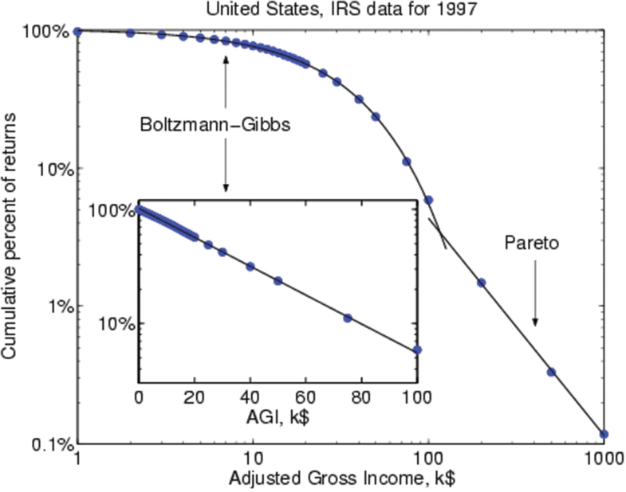
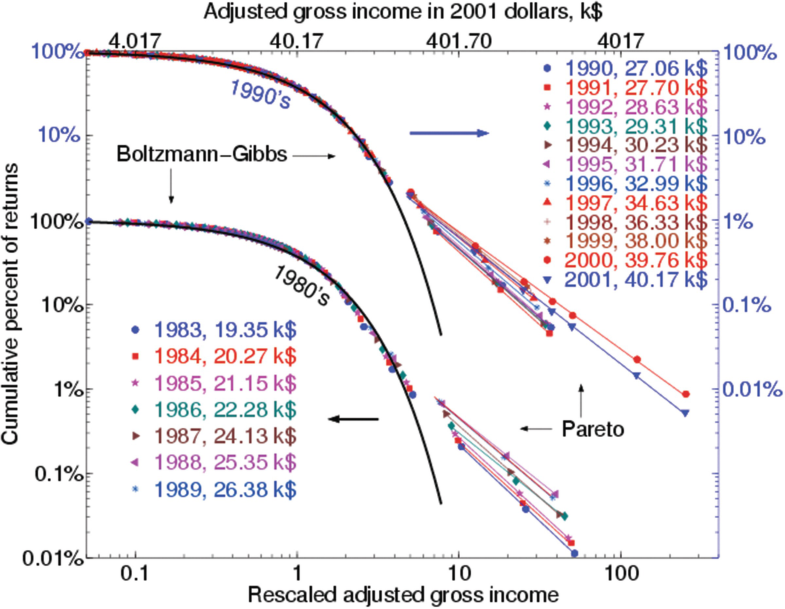

# (PART) Econofísica, entropía y complejidad {-}
# Econofísica, entropía y complejidad {-}

El término econofísica fue neologizado en 1995 en la segunda conferencia Statphys-Kolkata en Kolkata (antes Calcuta), India, por el físico H. Eugene Stanley, quien también fue el primero en usarlo en forma impresa (Stanley 1996). Mantegna y Stanley (2000, pp. Viii-ix) definen "el campo multidisciplinario de la econofísica" como "un neologismo que denota las actividades de los físicos que están trabajando en problemas económicos para probar una variedad de nuevos enfoques conceptuales derivados de las ciencias físicas" Chakrabarti 2005, pág. 225).

## Los orígenes y la naturaleza de la econofísica {-}

El término econofísica fue neologizado en 1995 en la segunda conferencia Statphys-Kolkata en Kolkata (antes Calcuta), India, por el físico H. Eugene Stanley, quien también fue el primero en usarlo en forma impresa (Stanley et al. 1996a). Mantegna y Stanley (1999, pp. viii-ix) definen “el campo multidisciplinario de la econofísica” como “un neologismo que denota las actividades de los físicos que están trabajando en problemas económicos para probar una variedad de nuevos enfoques conceptuales derivados de las ciencias físicas” Chakrabarti 2005, pag. 225).

La lista de tales problemas ha incluido distribuciones de rendimientos en los mercados financieros (Mantegna 1991; Levy y Salomón1997; Bouchaud y Cont1998; Gopakrishnan y col.1999; Lux y Marchesi1999; Sornette y Johansen2001; Farmer y Joshi2002; Li y Rosser2004) la distribución de la renta y la riqueza (Drăgulescu y Yakovenko 2001; Bouchaud y Mézard2000; Chatterjee y col.2007; Yakovenko y Rosser Jr.2009), la distribución de los choques económicos y las variaciones de la tasa de crecimiento (Bak et al. 1993; Canning y col.1998), la distribución del tamaño de las empresas y las tasas de crecimiento (Stanley et al. 1996b; Takayasu y Okuyama1998; Botazzi y Secchi2003), la distribución del tamaño de las ciudades (Rosser Jr 1994; Gabaix1999) y la distribución de descubrimientos científicos (Plerou et al. 1999; Sornette y Zajdenweber1999), entre otros problemas, todos los cuales a veces se considera que no siguen patrones normales o gaussianos que pueden describirse completamente mediante media y varianza. Las principales fuentes de enfoques conceptuales de la física utilizados por los economistas han sido los modelos de mecánica estadística (Spitzer1971), modelos geofísicos de terremotos (Sornette 2003), y modelos de avalanchas de "pilas de arena", este último con criticidad autoorganizada (Bak 1996). Uno de los primeros físicos en afirmar la identidad esencial de los métodos estadísticos utilizados en física y ciencias sociales fue Majorana (1942), que ha sido visto por algunos economistas como un precursor.

Un tema común entre quienes se identifican a sí mismos como economistas es que la teoría económica estándar ha sido inadecuada o insuficiente para explicar las distribuciones no gaussianas observadas empíricamente para varios de estos fenómenos, como la asimetría "excesiva" y las "colas gruesas" leptokurtóticas (McCauley 2004; Chatterjee y Chakrabarti2006; Lux2009). El surgimiento de la econofísica siguió bastante pronto a las influyentes interacciones y discusiones que ocurrieron entre grupos de físicos y economistas en el Instituto Santa Fe (Anderson et al.1988; Arthur y col.1997a), y algunos de los físicos involucrados en estas discusiones también se involucraron en el movimiento de la econofísica.

Ahora llegamos a una gran curiosidad e ironía en este asunto: algunas de las principales técnicas utilizadas por los economistas fueron desarrolladas inicialmente por los economistas (y muchas otras desarrolladas por los matemáticos), y algunas de las ideas asociadas con los economistas fueron desarrolladas por los físicos. Por lo tanto, en cierto sentido, estos esfuerzos de los físicos se asemejan a traer carbón a Newcastle, excepto que debe admitirse que muchos economistas olvidaron o nunca supieron de estos temas o métodos. Esto es cierto para el más canónico de tales modelos, la distribución de Pareto (Pareto1897).

## El papel de la distribución de Pareto {-}

Si hay un solo tema que une a los economistas es la insistencia en que muchos fenómenos económicos ocurren de acuerdo con distribuciones que obedecen a leyes de escala más que a la normalidad gaussiana. Ya sean simétricas o sesgadas, las colas son más gruesas o más largas de lo que serían si fueran gaussianas, y parecen ser lineales en las cifras con el logaritmo de una variable representado frente a su distribución de probabilidad acumulada. Buscan procesos físicos, con mayor frecuencia a partir de la mecánica estadística, que puedan generar estas distribuciones no gaussianas que obedezcan las leyes de escala.

La versión canónica (y original) de tal distribución fue descubierta por el economista y sociólogo matemático Vilfredo Pareto, en 1897. Sea N el número de observaciones de una variable que exceden un valor x con A y α constantes positivas. Luego

$$N=A x^{-\alpha}$$

Esto exhibe la propiedad de escala en que

$$\ln (N)=\ln A-\alpha \ln (x)$$

Esto se puede generalizar a una forma estocástica más clara reemplazando N con la probabilidad de que una observación exceda x . Pareto formuló esto para explicar la distribución del ingreso y la riqueza y creía que había un valor universalmente verdadero para α que equivalía a aproximadamente 1,5. Estudios más recientes (Clementi y Gallegati2005) sugieren que son solo los extremos superiores de la distribución de la renta y la riqueza los que siguen a tal propiedad de escala, con los extremos inferiores siguiendo la forma logarítmica normal de la distribución gaussiana que se asocia con el paseo aleatorio, originalmente argumentado para la totalidad de la distribución de la renta por Gibrat (1931), un punto más estudiado por Yakovenko y Rosser Jr (2009), Shaikh (2016), y Shaikh y Jacobo (2020).

El paseo aleatorio y su distribución logarítmica normal asociada es el gran rival de la distribución de Pareto y sus parientes en la explicación de los fenómenos económicos estocásticos. Solo unos años después de que Pareto hiciera su trabajo, se descubrió la caminata aleatoria en un doctorado. tesis sobre mercados especulativos del matemático Louis Bachelier (1900), cinco años antes de que Einstein lo usara para modelar el movimiento browniano, su primer uso en física (Einstein 1905). Aunque la distribución de Pareto tendría sus defensores para explicar la dinámica de precios estocástica (Mandelbrot1963), la caminata aleatoria se convertiría en el modelo estándar para explicar la dinámica de los precios de los activos durante muchas décadas, aunque serían los rendimientos de los activos los que se modelarían en lugar de los precios de los activos directamente como lo hizo Bachelier originalmente. Como ironía adicional, fue un físico, MFM Osborne (1959), quien fue uno de los defensores influyentes del uso de la caminata aleatoria para modelar los rendimientos de los activos. Se suponía que era el paseo aleatorio gaussiano el que subyacía a la dinámica de los precios de los activos cuando se desarrollaban conceptos básicos de economía financiera como la fórmula de Black-Scholes (Black y Scholes1973). Si p es el precio, R es el rendimiento debido a un aumento de precio, B es la deuda y σ es la desviación estándar de la distribución gaussiana, Osborne caracterizó el proceso dinámico de precios por

$$\mathrm{d} p=R p \mathrm{~d} t+\sigma p \mathrm{~d} B$$

Mientras tanto, físicos, matemáticos y economistas realizaron una variedad de esfuerzos durante mucho tiempo para modelar una variedad de fenómenos usando la distribución de Pareto o una de sus parientes o generalizaciones, como el Lévy estable (1925) distribución, antes de la clara aparición de la econofísica. Alfred J. Lotka (1926) vio los descubrimientos científicos siguiendo este patrón. George Zipf (1941) vería los tamaños de las ciudades como si lo hicieran. Benoit Mandelbrot (1963) vio los precios del algodón hacerlo y se inspiró para descubrir la geometría fractal al estudiar las matemáticas de la propiedad de escala (Mandelbrot 1963, 1997). Ijiri y Simon (1977) vieron los tamaños de las firmas también siguiendo este patrón, un resultado confirmado más recientemente por Axtell (2001).

## El papel de la mecánica estadística {-}

Además, los economistas utilizarían modelos de mecánica estadística para estudiar una variedad más amplia de dinámicas económicas antes del surgimiento de la econofísica como tal. Aquellos que lo hicieron incluyeron a Hans Fōllmer (1974), Lawrence Blume (1993), Steven Durlauf (1993), William Brock (1993), Duncan Foley (1994) y Michael Stutzer (1994), con Durlauf (1997) que proporciona una descripción general de un conjunto aún más amplio de aplicaciones. Sin embargo, en 1993 los economistas eran plenamente activos incluso si aún no se habían identificado con este término.

Si bien poco de este trabajo se enfoca explícitamente en generar resultados consistentes con las leyes de escala, ciertamente es razonable esperar que muchos de ellos puedan hacerlo. Es cierto que la visión más tradicional de los mercados eficientes en la que todos los agentes poseen información completa y expectativas racionales sobre un único equilibrio estable no se mantiene en estos modelos y, por lo tanto, la crítica de la econofísica tiene cierto peso. Sin embargo, muchos de estos modelos hacen supuestos de al menos formas de racionalidad y aprendizaje limitados, con la posibilidad de que algunos agentes incluso se ajusten a los supuestos más tradicionales. Stutzer (1994) reconcilia la formulación de máxima entropía de la mecánica estadística de Gibbs con una formulación de economía financiera relativamente convencional de la fórmula de opciones de Black-Scholes, basada en afirmaciones contingentes de Arrow-Debreu (Arrow 1974). Brock y Durlauf (2001) formalizan agentes heterogéneos que interactúan socialmente dentro de un marco de elección discreta que maximiza la utilidad. 1 Ninguno de estos genera específicamente resultados de ley de escala, pero no hay nada que les impida hacerlo potencialmente.

Si bien algunos economistas buscan integrar sus hallazgos con la teoría económica, como se señaló anteriormente, muchos buscan reemplazar la teoría económica convencional, considerándola inútil y limitada. Una ironía en este esfuerzo es que se ha argumentado que la teoría económica neoclásica convencional en sí misma fue sustancialmente el resultado de importar concepciones de la física del siglo XIX a la economía, sin que todos los observadores lo aprobaran (Mirowski1989a). Muchos consideran que la culminación de este esfuerzo son los fundamentos del análisis económico de Paul Samuelson (1947), cuya licenciatura fue en física en la Universidad de Chicago. El propio Samuelson señaló con aprobación que la disertación de Irving Fisher de 1892 (1920) fue supervisado en parte por el pionero de la mecánica estadística, J. Willard Gibbs (1902), y ya en 1801, Nicholas-François Canard (1969) concibió la oferta y la demanda como "fuerzas" ontológicamente contradictorias en un sentido físico. De modo que la interacción entre la economía y la física se ha prolongado durante mucho más tiempo y es considerablemente más complicada de lo que se suele concebir.

La mayor parte de este trasfondo histórico más profundo de ir y venir no es conocido por los economistas actuales. Esto ha llevado a veces a que se formulen argumentos que son potencialmente problemáticos por diversos motivos. Estos han sido discutidos en un artículo crítico por Gallegati et al. (2006) denominado "Tendencias preocupantes en econofísica". Las tendencias que identificaron incluyeron una falta de conocimiento de la literatura previa (especialmente en economía), una tendencia a creer que se pueden encontrar regularidades empíricas universales en la economía que probablemente no están allí en contraste con lo que se encuentra en gran parte de la física, una tendencia a utilizar metodologías estadísticas poco rigurosas a veces poco mejores que simplemente mirar cifras y, finalmente, utilizar fundamentos teóricos cuestionables, como asumir principios de conservación en situaciones en las que es poco probable que se mantengan. McCauley (2008) respondió a su crítica, argumentando que la teoría económica es tan defectuosa que simplemente debería ser rechazada en su totalidad a favor de las ideas que provienen de la física. Rosser Jr (2008a, B) consideró este debate y señala que, de hecho, los economistas a menudo hacen suposiciones que no son ciertas, aunque claramente existen límites a lo irreales que pueden ser las suposiciones en un modelo útil. También argumenta que una forma de resolver esto es que los físicos y los economistas lleven a cabo más investigaciones de manera conjunta, y que se haya desarrollado algo de eso.

## Econoquímica y Econobiología {-}

Curiosamente, pero como era de esperar, dada la tremenda atención prestada al nuevo movimiento de la econofísica, ha engendrado imitadores desde 2000 en la forma de la econoquímica y la econobiología , aunque estas no han tenido ni mucho menos el mismo grado de desarrollo. El primer término es el título de un curso de estudio establecido en la Universidad de Ulm por Barbara Mez-Starke y se utilizó para describir el trabajo de Hartmann y Rössler (1998) en una conferencia en 2002 en Urbino, Italia (ver también Padgett et al. (2003) para un esfuerzo más reciente). El último término apareció por primera vez en Hens (2000), aunque McCauley (2004, págs. 196-199) lo descarta como un competidor no digno de la econofísica. Sin embargo, ha existido una larga tradición entre los economistas de abogar por inspirarse más en la biología que en la física (Hodgson1993a, B), remontándose al menos hasta la famosa declaración de Alfred Marshall de que la economía 2 es "una rama de la biología interpretada en sentido amplio" (Marshall1920, pag. 637), incluso cuando se podría decir que el aparato analítico real de Marshall se basó más en la física que en la biología.

## Econofísica y entropía {-}

> “A lo largo de los años he llegado a tener algo de impaciencia y aburrimiento con aquellos que intentan encontrar un análogo de la entropía de Clausius o Boltzman o Shannon para ponerlo en teoría económica. Es la estructura matemática de la termodinámica clásica (fenomenológica, macroscópica, no estocástica) que tiene isomorfismos con la economía teórica . ”- Paul A. Samuelson, (1990, pag. 263)
>
> "... a lo largo de su carrera [de Samuelson] ... el maestro de la retórica científica, insinuando continuamente los paralelismos entre la teoría neoclásica y la física del siglo XX, y los niega conscientemente, generalmente en el mismo artículo." - Philip Mirowski, (1989b, pag. 186]

El papel problemático de la entropía en la econofísica se destaca por las citas presentadas anteriormente: que el economista posiblemente más influyente del siglo XX, Paul A. Samuelson, lo jugó en ambos sentidos con respecto al papel del concepto de entropía en el desarrollo de la teoría económica, y más ampliamente el papel de la física en la economía. Si bien ridiculizaba regularmente las aplicaciones del concepto de entropía en economía, más poderosamente que cualquier otro economista impuso conceptos extraídos de la física en la economía neoclásica estándar, incluida esa parte importante de la economía, la mecánica estadística, una contradicción señalada con tanta fuerza por Mirowski.

El término "econofísica" fue introducido verbalmente por H. Eugene Stanley en una conferencia en Calcuta en 1995, y extensamente en forma impresa por Mantegna y Stanley (1999) quien lo identificó con físicos que aplicaban ideas de la física a la economía. Esta formulación se vuelve problemática cuando entendemos que las personas formadas como físicos lo han estado haciendo durante mucho tiempo, siendo el propio Samuelson un ejemplo destacado, junto con el de aquellos que recibieron el Premio Nobel de Economía antes que él, Jan Tinbergen (1937), cuyo profesor principal fue Paul Ehrenfest, quien formuló la "hipótesis ergódica" con su esposa (1911), basándose en el trabajo de su profesor principal, Ludwig Boltzmann (1884). 3 Boltzmann vinculó el estudio de la mecánica estadística con el concepto de entropía desarrollado inicialmente por Clausius (1867), quien a su vez se inspiró en el trabajo sobre la termodinámica de las máquinas de vapor de Carnot en 1824. La formulación más simple de la ley de la entropía tomó la forma de la segunda ley de la termodinámica: que en un sistema termodinámico cerrado aumenta la entropía.

Dado que estos préstamos de la física a la economía han sido anteriores al movimiento más reciente de los físicos para aplicar sus modelos a la economía, ampliaremos el concepto de economía independientemente de si estas aplicaciones fueron realizadas por personas que eran principalmente físicos, principalmente economistas, o que fueron posiblemente ambos, con muchos economistas importantes que se habían formado originalmente como físicos, con Tinbergen como estudiante de Ehrenfest como un ejemplo.

Con respecto a la aplicación específica de la idea de la entropía en la economía y, por tanto, como una forma de econofísica, distinguiremos entre dos enfoques básicos. Uno puede ser etiquetado como ontológico mientras que el otro puede verse como metafórico, aunque algunos involucrados en esto a veces han confundido a estos dos, como los energéticos Helm, Winiarski y Ostwald, como lo describe Mirowski (1989a). En la formulación ontológica, se considera que la base de la economía son los procesos físicos y biológicos impulsados ​​por la energía, siendo la Segunda Ley de la Termodinámica un principio organizador clave para esta base, con Georgescu-Roegen (1971) el exponente más influyente de esta idea, aunque también fue un crítico de ella, como señaló Rosser Jr. (1991). Este punto de vista sigue más la tradición de Carnot y Clausius, pero también depende del trabajo de Boltzmann modificado por Gibbs (1902) en mecánica estadística, con la formulación de Boltzmann-Gibbs de la ley de la entropía. Este enfoque tiene sus mayores defensores entre los economistas ecológicos, algunos de los cuales dicen que este punto de vista representa la "economía biofísica" (Christensen1989).

El enfoque metafórico se basa más en la formulación de información de la entropía debida a Shannon y Weaver (1949), con aplicaciones en las finanzas y la teoría del equilibrio, muchas de ellas más estrechamente vinculadas a la economía moderna. En última instancia, estos dos conceptos de entropía comparten matemáticas comunes de distribuciones de probabilidad de logaritmos de productos de estados posibles del mundo, incluso si tienen aplicaciones considerablemente diferentes. Si bien gran parte de la econofísica moderna se preocupa más por otros asuntos, como las distribuciones de variables de la ley de potencia, el concepto de entropía entra en muchas aplicaciones de la econofísica, con importantes nuevos enfoques de la economía que se basan en estas formulaciones más metafóricas. 4

## Unidad de los conceptos centrales de la entropía {-}

La forma más utilizada de la ecuación de Boltzmann para la entropía está en su tumba, aunque nunca la escribió de esa manera (Uffink 2014). Implica W, la probabilidad termodinámica de un estado agregado de un sistema de moléculas de gas, siendo k la constante de Boltzmann y S la entropía. Toma la forma

$$S=k \ln W$$

Dada N estados microscópicos del sistema, la probabilidad de una molécula de gas está en el estado i-ésimo es N i / N . Entonces W viene dado por (Chakrabarti y Chakraborty2006)

$$W=N ! / \Pi N_{i} !$$

Esto significa que la entropía de Boltzmann se puede reescribir como

$$S=k \ln \left(N ! / \Pi N_{i} !\right) .$$

La entropía básica de Shannon viene dada por H de la distribución de probabilidad de los estados de incertidumbre informativa para el mensaje i. de H ( p 1 … p n ). Esto entonces equivale a (Shannon y Weaver1949; Renyi1961)

$$H\left(p_{1} \ldots p_{n}\right)=-k \Sigma p_{i} \ln p_{i}$$

Reconociendo que p i  =  N i / N , la unidad básica de estos dos conceptos aparece a medida que N aumenta, lo que lleva a la fórmula de Boltzmann en ( 4.6 ) a aproximarse a (Tsallis1988; Thurner y Hanel2012)

$$S=-k N \Sigma p_{i} \ln p_{i}$$

lo que significa que en el límite cuando N se acerca al infinito, la entropía de Boltzmann es proporcional a la entropía de Shannon.

## La entropía ontológica y la econofísica como límite fundamental del crecimiento {-}

El enfoque ontológico de la econofísica se deriva del papel directo y fundamental de la energía en la economía, no solo para la producción industrial o el suministro de electricidad o transporte, sino a nivel ecológico o biofísico, el de la energía solar que impulsa la biosfera global. Esto es más un regreso a la visión de la termodinámica de Carnot y Clausius, donde la entrada continua de energía solar muestra la apertura del sistema de la tierra que le permite evitar la ley de la entropía mientras dure el sol (Georgescu-Roegen1971; Rosser Jr.1991). 5 Sin embargo, esa energía solar que llega en sí es finita y, por lo tanto, proporciona un límite directo a la actividad económica que depende de los ecosistemas a través de los cuales la energía solar se disipa en las cadenas alimentarias que son impulsadas por esa energía. Además, Georgescu-Roegen extendió este argumento a insumos de recursos materiales más amplios, argumentando que también están sujetos a una forma de la ley de la entropía que también proporciona límites adicionales a la economía. Más ampliamente para él (Georgescu-Roegen1971, pag. 281) “el proceso económico consiste en una transformación continua de baja entropía en alta entropía, es decir, en desperdicio irrevocable o, con un término de actualidad, en contaminación”.

Si bien las variaciones de este argumento se han vuelto muy influyentes, especialmente en la economía ecológica como con Martinez-Allier (1987), también se ha enfrentado a fuertes críticas. Así, Gerelli (1985) argumenta que la escala de la entrada solar es tal que está en órdenes de magnitud más allá de limitar realmente la economía mundial, con muchas otras limitaciones más mundanas más relevantes en el corto plazo. Nordhaus (1992) estimó que la entropía es hasta 12 órdenes de magnitud por debajo de la tecnología como límite para el crecimiento, con Young (1994) pesando de manera similar. En ese sentido, la reducción de las fuentes de energía almacenadas y sus límites, como ocurre con los combustibles fósiles, puede ser más relevante con la contaminación derivada de su uso, incluso más limitante, como con resultados como el cambio climático derivado de la quema de dichos combustibles que liberan su dióxido de carbono almacenado. Otros críticos han enfatizado el ingenio ilimitado de la mente humana como Julian Simon, quien argumentó que (1981, pag. 347) "aquellos que ven el universo relevante como ilimitado ven la segunda ley de la termodinámica como irrelevante para la discusión".

Otra figura importante en esta línea de argumentación fue Alfred J. Lotka (1925), el padre del concepto de ciclos depredador-presa. Lotka argumentó que la ley de la entropía es una fuerza impulsora profunda en la evolución, una fuente de una dirección teleológica del proceso hacia una mayor complejidad. Vio esto como la base física fundamental de la biología que necesitaba ser estudiado matemáticamente y, a su vez, vio que la economía se derivaba del ecosistema, como lo han hecho los economistas ecológicos más recientes. Irónicamente, Lotka fue una tremenda influencia en Paul Samuelson, quien lo citó de manera prominente en su obra maestra, Foundations of Economic Analysis (1947), aunque más por su categorización de las condiciones de estabilidad de los sistemas lineales que por sus argumentos sobre la ley de la entropía o su relación con la economía.

## La entropía ontológica y la visión energética del valor económico {-}

Estrechamente relacionada con el argumento de que los flujos de energía que se disipan a medida que opera la ley de la entropía son la base de la economía, está la idea de que la energía o alguna medida de entropía deberían ser la base para medir el valor en una economía. Esto fue propuesto por primera vez por físicos "energéticos" de finales del siglo XIX y principios del XX. Así Helm (1887) y Winiarski (1900) argumentó que el oro era "energía sociobiológica". Más cerca del argumento de la entropía estaba Ostwald (1908) cuya opinión era que los factores de conversión basados ​​en la disponibilidad física de formas específicas de energía eran la clave para la determinación del valor fundamental. Ampliando esto, Julius Davidson (1919) argumentó que la ley de los rendimientos decrecientes en economía 6 se basaba en última instancia en la ley de la entropía. Mucho más tarde Davis (1941) argumentaría que la utilidad del dinero era una forma de "entropía económica", aunque Lisman (1949) señaló que esto no era operacionalmente equivalente a cómo funciona la ley de la termodinámica en física, y Samuelson (1972) simplemente descartó estos argumentos como "chiflados".

Curiosamente, algunos de los que apoyaban la idea de que la entropía desempeñaba un papel ontológico fundamental en la economía también tenían problemas con tales enfoques del valor. Lotka (1925, p. 355) señaló que,

“El proceso físico es un caso típico de 'acción de disparo' en el que la relación entre la energía liberada y la energía aplicada no está sujeta a ninguna ley general restrictiva (por ejemplo, un toque del dedo sobre un interruptor puede disparar toneladas de dinamita). A diferencia del caso de los factores de conversión de la termodinámica, el factor de proporcionalidad viene determinado aquí por el mecanismo particular empleado ".

Lo mismo ocurre con Georgescu-Roegen (1971), aunque veía la entropía como el límite último del crecimiento, no la veía tan útil para determinar el valor, que en última instancia veía como resultado de la utilidad. Por lo tanto, nadie quiere el hongo venenoso de baja entropía y algunas personas valoran más el huevo batido de alta entropía que el huevo crudo de baja entropía. Estas son cuestiones de utilidad, y aunque Georgescu-Roegen no veía la utilidad (o la utilidad marginal para ser más precisos) como la única fuente de valor como lo hacían los teóricos subjetivistas de la escuela austriaca, ciertamente la veía como muy importante y era un importante desarrollador de la teoría de la utilidad moderna al principio de su carrera. 7

## Entropía metafórica y valor de equilibrio general {-}

Pasando al corazón de la economía, la entropía se ha propuesto como una alternativa a la explicación convencional del valor de Arrow-Debreu. Esa visión estándar tiene el equilibrio como un vector de precios que son puntos fijos. La alternativa entrópica reconoce la realidad de un mundo estocástico en el que el equilibrio se describe mejor como una distribución de probabilidad de precios, ya que los precios nunca son los mismos en todas partes y en ningún momento para cualquier producto, excepto como medida de accidente cero. Una expresión temprana de esta idea se debe a Hans Fōllmer (1974). Un desarrollo más completo de esto se ha debido a Foley (1994), más tarde ampliado por Foley y Smith (2008).

El Foley básico (1994) El modelo implica supuestos sólidos como que todas las transacciones posibles dentro de una economía tienen la misma probabilidad. Sin embargo, su solución implica una distribución estadística de comportamientos en la economía donde una transacción particular es inversamente proporcional al exponencial de su precio de entropía de equilibrio, y esto proviene de un conjunto de precios sombra de entropía máxima de Botlzmann-Gibbs. El equilibrio general walrasiano es un caso especial de este modelo cuando la "temperatura" es cero. La forma más general carece de las implicaciones habituales de bienestar y permite la posibilidad de precios negativos como en el caso de las subastas de Herodotus (Baye et al.2012). 8 Sin embargo, Foley enfatiza el papel crucial de las restricciones en este enfoque, algo que comparte con el modelo Arrow-Debreu.

Sea m mercancías, n agentes de tipo k que logren una transacción x de la cual hay h k [ x ] proporción de agentes de tipo k de r que realizan la transacción x de un conjunto de oferta A , de los cuales hay mn . Multiplicidad de una asignación para n agentes asignados a S acciones, cada uno de ellos s , viene dada por:

$$W\left[n_{s}\right]=n ! /\left(n_{1} ! \ldots n_{s} ! \ldots n_{S} !\right)$$

La entropía de Shannon de esta multiplicidad viene dada por:

$$H\left\{h^{k}[x]\right\}=-\Sigma_{k=1}^{r} W^{k} \Sigma_{x \varepsilon A k} h^{k}[x] x=0$$

Maximizar esta formulación entrópica sujeta a las restricciones de viabilidad apropiadas, que si no está vacía, da la solución canónica única de Gibbs:

$$H^{k}[x]=\exp [-\Pi x] / \Sigma_{x} \exp [-\Pi x]$$

donde Π son vectores de los precios sombra de la entropía.

## Entropía entre econofísica y sociofísica {-}

Otro uso metafórico de los conceptos de entropía ha sido en conjunto con ese pariente cercano de la econofísica, la sociofísica . Acuñado inicialmente por Galam et al. (mil novecientos ochenta y dos), sigue la sociodinámica del neologismo desarrollada por Weidlich y Haag (1980). Un énfasis importante de esta sociofísica está en el modelado de la dinámica de grupo, incluido el pastoreo. Una solución favorecida por Weidlich y Haag (1983) es la ecuación maestra, utilizada especialmente para estudiar patrones migratorios, entre otros fenómenos. Cuando las restricciones no resuelven de manera única el modelo estocástico de esta ecuación, un proceso de Markov de orden n puede surgir como la única solución de entropía máxima (Lee y Pressé2012).

Si bien no está tan desarrollada como la econofísica, la sociofísica ha seguido su fundación por Galam junto con Weidlich y Haag a lo largo de una variedad de caminos, con Chakrabarti et al. (2008) proporcionando una excelente descripción de estas investigaciones. Ambas posibilidades de aplicar el concepto de entropía a este enfoque han sido estudiadas en profundidad por Mimkes (2008), quien también se esfuerza por extender su análisis a todas las ciencias sociales. En su formulación vemos un retorno a la cuestión de las aplicaciones ontológicas versus metafóricas del concepto de entropía cuando Mimkes vincula la entropía con la naturaleza fundamental de la función de producción. Si bien esto evoca la visión de Georgescu-Roegen (1971) donde los procesos reales de la economía son fundamentalmente una elaboración de la Segunda Ley de la Termodinámica, Mimkes finalmente se retira a una aplicación más metafórica donde es la formulación matemática de la entropía como un dispositivo descriptivo para los datos sobre los resultados distributivos en la economía que es el foco principal del análisis. Si bien invoca e implica la percepción ontológica más profunda, al final gana el enfoque más metafórico. Sin embargo, no hay ninguna razón por la cual una sociofísica más desarrollada pueda no involucrar aún más seriamente el enfoque ontológico.

## Modelado financiero entrópico metafórico {-}

En la portada de sus Fundamentos del análisis económico (1947), Paul Samuelson citó a Gibbs diciendo: "Las matemáticas son un lenguaje". Eso es ciertamente. Pero en el caso de la entropía de Shannon, así como en los modelos financieros basados ​​en las matemáticas de la entropía, es una metáfora más que una ontología lingüística.

Basándose en muchas discusiones de varios economistas, Schinkus (2009) argumenta que los economistas están más inclinados que los economistas habituales a abordar los datos sin ideas preconcebidas sobre distribuciones o valores de parámetros, aunque pueden estar más inclinados a basarse en ideas de la física, con entropía entre las relacionadas con la modelización financiera. Así, Dionosio et al. (2009, pag. 161) argumentan que:

> "La entropía es una medida de dispersión, incertidumbre, desorden y diversificación utilizada en procesos dinámicos, en estadística y teoría de la información, y se ha adoptado cada vez más en la teoría financiera".

Las aplicaciones de la ley de la entropía usando entropía de Shannon o distribuciones de Boltzmann-Gibbs encajan fácilmente en distribuciones explicativas o de modelado que se basan en la lognormalidad, que son fácilmente consistentes con los enfoques gaussianos. Si bien sabemos que, en última instancia, estas entropías son esencialmente idénticas matemáticamente, la diferencia real es que creemos que está impulsada a la maximización como una ley de la física, mientras que en las más metafóricas observar un extremo de la entropía es simplemente una condición matemática útil.

Alguien que aproveche las dos medidas principales de entropía para desarrollar la teoría financiera central en la forma de la fórmula de fijación de precios de opciones de Black-Scholes (1973) es Michael J. Stutzer (1994, 2000). En el segundo de estos usó la entropía de Shannon para su generalización del vínculo, después de señalar que Cozzolino y Zahneri (1973) había utilizado la entropía de Shannon para derivar distribuciones logarítmicas normales del precio de las acciones, el mismo año en que Black y Scholes (1973) publicaron su resultado sin depender directamente de ninguna matemática de entropía. Por su generalización Stutzer (2000) planteó el problema en forma discreta al considerar un proceso de precio de mercado de valores dado por

$$\Delta p / p=\mu \Delta t+\sigma \sqrt{\Delta t \Delta z}$$

donde p es el precio, t es el intervalo de tiempo , y el segundo término en el lado derecho es el choque al azar, con estos distribuido ~ N (0, ? t ). Con Q como cantidad, rΔt la tasa libre de riesgo de retorno, y P la distribución real densidad riesgo condicional, un foco central es el riesgo condicional neutral dada por d Q / d P .

A partir de estos, se considera la entropía relativa que minimiza la densidad neutral al riesgo condicional que en efecto maximiza el orden

$$\arg \min _{\mathrm{d} Q / \mathrm{d} P} \int \log \mathrm{d} Q / d P d Q$$

sujeto a una restricción de martingala dada por

$$r \Delta t-E[(\Delta p / p)(d Q / d P]=0$$

A partir de esto, muestra que cuando los rendimientos de los activos son IID con choques distribuidos normalmente como se indica anteriormente, la densidad del producto martingala formada a partir de la entropía relativa que minimiza el riesgo condicional es la que se usa para calcular la fórmula de fijación de precios de opciones de Black-Scholes. Reconoce que esto no se generaliza fácilmente a distribuciones no gaussianas, como las de la ley de potencias, muy estudiadas por los economistas, lo que sugiere un enfoque más débil utilizando procesos heterocedásticos condicional auto regresivos generalizados (GARCH).

## Más metáfora, el proceso anti-entrópico de la burbuja de Minsky {-}

Como se discutió anteriormente, la maximización de la entropía implica una dinámica estocástica gaussiana. Estos no son consistentes con las distribuciones de la ley de energía que se ven en los rendimientos del mercado financiero o en las distribuciones de riqueza. Una fuente probable de esta diferencia es la tendencia a la dinámica de burbujas antientrópicas que puede describirse mediante el proceso de Minsky (Minsky1972, mil novecientos ochenta y dos; Kindleberger2001; Rosser Jr.1991). En lugar de nivelar las irregularidades, una burbuja especulativa puede aumentar las desviaciones de los resultados del equilibrio a largo plazo, ya sea de tipo entrópico estocástico como el modelo de Foley y otros o un equilibrio general determinista walrasiano. La dinámica de retroalimentación positiva que surge del impulso o el ruido de los comerciantes empuja los precios a extremos, alejándolos temporalmente de estos equilibrios, y por lo general terminan con algún tipo de colapso. Estos movimientos extremos conducen a las colas gordas kurtóticas que aparecen en la dinámica de rendimiento de los activos financieros de manera tan ubicua (Lux2009).

Minsky1972) argumentó que estas dinámicas emergen de manera endógena a través de mecanismos psicológicos en los que los agentes se vuelven complacientes con respecto al riesgo durante períodos de equilibrio entrópico con distribuciones gaussianas predominando en respuesta a choques exógenos. Pasan por etapas de creciente asunción de riesgos, en las que los índices de apalancamiento aumentan y emergen burbujas. La etapa final de este proceso involucra la dinámica Ponzi que se ha desquiciado completamente de los fundamentos. La riqueza ha aumentado drásticamente con los precios de la burbuja especulativa, pero al final la burbuja se derrumba, generalmente en un dramático Momento de Minsky cuando el pánico se apodera y los agentes venden el activo en masa (Kindleberger 1972). Con esto, la dinámica devuelve los precios a la zona de equilibrio entrópico a largo plazo, la "Venganza de la entropía".

Se ha entendido bien que históricamente tales dinámicas han adoptado generalmente una de tres formas diferentes (Rosser Jr. 1991, Cap. 5). Los tres de estos casos se muestran en este libro en las Figs. 2.1 , 2.2 , 2.3 (Rosser Jr. et al.   2012) para los activos que exhibieron cada uno de ellos durante el período de la Gran Recesión de 2007-2009, aunque la dinámica se muestra durante más tiempo, con uno de ellos (la vivienda en Estados Unidos) alcanzando su punto máximo antes de la crisis financiera más amplia que marcó el comienzo de la Gran Recesión.

El primer caso involucra un precio que sube de manera acelerada, solo para colapsar repentinamente después de alcanzar su punto máximo en un momento dramático de Minsky. Para el período de la crisis financiera, esto está bien demostrado por los precios del petróleo, que alcanzaron su punto máximo en julio de 2008 a $ 147 por barril, solo para bajar drásticamente a alrededor de $ 30 por barril en noviembre de 2008 (ver Figura 2.1 , este libro). Estos patrones se ven a menudo en burbujas especulativas de precios de materias primas. 

El segundo caso implica un aumento más gradual de los precios que luego disminuye también de manera gradual una vez alcanzado el pico. Se puede argumentar que tal caso no posee un Minsky Moment propiamente dicho en el sentido de un choque repentino asociado con un pánico, aunque puede haber emociones de pánico involucradas para los agentes en tal burbuja y su declive. El ejemplo de la crisis financiera es que si la vivienda en Estados Unidos, cuyos precios comenzaron a subir en 1998 y luego alcanzaron su punto máximo en 2006, disminuyeron a partir de entonces durante varios años, como se muestra en la figura 2.2 . (este libro). De hecho, el sector inmobiliario parece más propenso a mostrar este patrón, y una explicación que parece ser válida especialmente para el sector inmobiliario residencial es que la gente se niega a vender inmediatamente durante la recesión, creyendo que los precios son "injustos" y "demasiado bajos", lo que lleva a ellos alquilan su vivienda si deben mudarse o simplemente se niegan a vender. Por lo tanto, tales patrones tienden a mostrar una caída en el volumen de ventas durante la caída más que una rápida caída en el precio, que cae a medida que finalmente la gente se rinde y acepta los precios más bajos.

El tercer caso es históricamente el más común según lo documentado por Kindleberger (2001, Apéndice B). Implica precios que suben a un pico y luego disminuyen por un tiempo de manera gradual durante un "período de dificultades financieras" (Minsky1972), luego, en un momento posterior, experimentando el Momento Minsky y chocando con fuerza. Durante la crisis financiera, la mayoría de los mercados de activos financieros mostraron este patrón, y la figura 2.3 (este libro) muestra el ejemplo del mercado de valores estadounidense medido por el promedio industrial Dow-Jones. Alcanzó su punto máximo en octubre de 2007, pero luego se desplomó en septiembre de 2008, 11 meses después de atravesar un período de declive más errático. 

Esta dinámica no puede modelarse asumiendo agentes homogéneos. En la cima, los "iniciados" inteligentes o afortunados se venden a "forasteros" menos inteligentes o afortunados que continúan aferrándose al activo, al igual que los propietarios en el segundo caso se niegan a vender sus casas inicialmente a medida que el precio baja. El Momento Minsky finalmente llega cuando el pánico golpea a este grupo de agentes y venden en masa en el choque. Aunque este es, con mucho, el patrón más común de burbujas especulativas en la historia, ha habido pocos esfuerzos para modelarlo. Gallegati et al. (2011) en un modelo basado en agentes derivado en última instancia del enfoque de Brock-Hommes (Brock y Hommes 1997). En este marco, el comportamiento de agentes heterogéneos está determinado cualitativamente por un parámetro de contagio y una disposición a cambiar el parámetro de comportamiento. El mecanismo del colapso retrasado después del período de dificultades financieras provino de una restricción de riqueza como la que encuentran los agentes en los mercados de activos con llamadas de margen. Cuando el precio cae por debajo de cierto nivel, pueden verse obligados a vender. La Figura 2.4 (este libro) muestra una simulación que muestra el patrón general y también muestra el impacto de un aumento en la fuerza del parámetro de contagio, que mueve el pico más alto y lo retrasa levemente (Gallegati et al. 2011).

## Modelado de la dinámica de distribución de la riqueza y la renta mediante la mecánica estadística {-}

Al estudiar la dinámica de distribución de la riqueza y el ingreso, encontramos que la relación entre las distribuciones de la ley de potencias no basadas en la entropía y las distribuciones de la ley de potencias juega un papel central en el modelado de estos sistemas dinámicos. En particular, parece cada vez más que, si bien la dinámica de la riqueza refleja en gran medida las distribuciones de la ley de poder, la dinámica de distribución del ingreso puede ser una combinación, con distribuciones de Boltzmann-Gibbs relacionadas con la entropía que explican mejor la distribución del ingreso para el 97-98 por ciento más pobre, mientras que una distribución de la ley de poder de Pareto puede funcionar mejor para el nivel superior de ingresos, donde la dinámica de la riqueza puede desempeñar un papel más importante (Drăgulescu y Yakovenko2001; Yakovenko y Rosser Jr.2009).

La conciencia de la posibilidad de utilizar ideas de entropía en la medición de la distribución del ingreso comenzó cuando los economistas buscaban generalizaciones de las diversas medidas en competencia que se han utilizado para estudiar la distribución del ingreso. Así, en 1981, Cowell y Kugal (1981) buscó una formulación axiomática generalizada para medidas aditivas de distribución del ingreso. Descubrieron que al agregar dos axiomas al enfoque habitual, pudieron demostrar que un enfoque de entropía generalizada podría subsumir la medida de Atkinson ampliamente estudiada (1970) y la medida de Theil (Bourguignon 1979). Si bien la medida de Atkinson se ha utilizado más ampliamente y es capaz de distinguir la asimetría de las colas, la de Theil puede tener más generalidad. Bourguignon1979) muestra que es la única medida de desigualdad descomponible "ponderada por ingresos" que es homogénea en cero. Cowell y Kugal (1981) muestran que al agregar un axioma de sensibilidad a los demás, el índice de Theil es el único que se puede derivar de un concepto de entropía generalizado.

Estas primeras discusiones también involucraron fuertes reclamos con respecto a las dificultades de vincular las medidas de entropía con las distribuciones de la ley de potencia, reclamos que ahora parecen exagerados hasta cierto punto. Así encontramos a Montroll y Schlesinger (1983, pag. 209) alegando que:

> "La derivación de distribuciones con colas de potencia inversa a partir del formalismo de máxima entropía sería una consecuencia sólo de una condición auxiliar no convencional que implica la especificación del promedio de una función logarítmica complicada".

Esta afirmación puede ser exagerada, aunque de hecho las funciones logarítmicas están involucradas en la relación entre las dos, lo que no es sorprendente dado que las medidas de entropía son esencialmente logarítmicas.

El enfoque de distribución de la ley de poder domina la discusión de la dinámica de distribución de la riqueza, al igual que la dinámica de los mercados financieros. El padre de este enfoque fue Vilfredo Pareto (1897), quien inicialmente se formó como ingeniero, pero luego se convirtió en socio-economista ya que su teoría involucraba la relación entre clases sociales a lo largo del tiempo. Muy apropiadamente, la motivación original y el enfoque de estudio de Pareto fue, de hecho, la distribución del ingreso. Afirmó una verdad universal asociada con un parámetro de distribución de ingresos estimado. Estaba equivocado, especialmente dado que su teoría se ajusta a mejores distribuciones de riqueza en lugar de distribuciones de ingresos, como se señaló anteriormente. Pareto argumentó incorrectamente que su coeficiente supuestamente universal para la explicación de la ley de poder de la distribución del ingreso encajaba en su teoría de la "circulación de las élites", en la que no se podía hacer nada para igualar el ingreso porque el proceso político simplemente implicaría sustituir una élite de poder por otro sin cambios apreciables en la distribución del ingreso. Pero debemos reconocer que formuló este punto de vista a fines del siglo XIX, cuando no había habido un siglo de cambios importantes en la estructura socioeconómica en ninguna parte. No hace falta decir que no mucho después hubo grandes cambios en la distribución (Piketty2014), incluso cuando su método pasó a ser "subterráneo", solo para ser revivido para otros usos, como describir distribuciones de tamaño metropolitano urbano (Auerbach 1913).

La preocupación moderna por la distribución del ingreso basada en los conceptos de la física de la ley de potencia de Pareto se debió a un sociólogo, John Angle (1986). Después de la aparición de la economía actual, muchos dieron un paso adelante para aplicar las distribuciones de la ley de potencia para estudiar la dinámica de las distribuciones de riqueza. Basándose en el trabajo de Pareto, quien pensó erróneamente que había encontrado un coeficiente universal para la distribución del ingreso, los economistas encontraron que las distribuciones actuales de la riqueza se ajustan al punto de vista de la ley de poder de Pareto (Bouchaud y Mézard2000; Chakraborti y Chakrabarti2000; Salomón y Richmond2002).

En este punto, es necesario considerar la cuestión de si estamos tratando con modelos ontológicos en contraposición a modelos "meramente" metafóricos en estos asuntos. Sabemos que existen tendencias estocásticas para la dinámica de la riqueza y la renta, pero no es del todo obvio que los diversos imperativos aparentes para la maximización o minimización de la entropía estén realmente impulsando los resultados. Sin embargo, muchos que estudian estos temas ven procesos termodinámicos subyacentes a las tendencias básicas de la dinámica de distribución de la riqueza y el ingreso. Estos procesos no son tan directos como la dirección ontológica basada en las máquinas de vapor de Carnot, pero derivan de tendencias más amplias de la dinámica de distribución de la riqueza y el ingreso que ocurren en ausencia de cambios sustanciales en las políticas públicas con respecto a las políticas distributivas.

Pareto se equivocó en su propuesta original. Pensó que había encontrado una ley universal de distribución del ingreso que encajaba con su teoría de la “circulación de las élites”, dentro de la cual no importaba qué grupo de élite gobernara la sociedad, la distribución subyacente del ingreso no cambiaría. Él estaba equivocado. El legado de su enfoque ha estado en el estudio de las distribuciones de riqueza, donde ahora se entiende que su presentación de las leyes de poder explica las distribuciones de riqueza en lugar de las distribuciones de ingresos.

La distribución de Pareto viene dada por:

$$N=A / x^{\alpha}$$

donde N es el número de observaciones por encima de x , y A y α son constantes. Esto incluye como casos especiales una amplia variedad de otras formas que subyacen a muchos modelos económicos. El caso especial cuando α  = 1 conduce a la "Ley de Zipf", (Zipf1941), ampliamente visto para describir la distribución del tamaño urbano, así como muchos otros, aunque hasta qué punto se aplica esta "ley" es un tema de debate continuo.

Yakovenko y Rosser Jr. (2009) presentan un análisis de distribución de ingresos unificado que combina una formulación entrópica de Boltzmann-Gibbs para la distribución de ingresos más bajos con una distribución de la ley de potencia Paretiana para los niveles más altos de ingresos. El modelo hace una suposición heroica de conservación del dinero o los ingresos o la riqueza, lo que empíricamente no es irrazonable para los Estados Unidos desde mediados de la década de 1970 para los niveles medios, incluso cuando los estratos superiores han experimentado niveles crecientes. Pero esto encaja con la combinación de un modelo entrópico logarítmico normal para la mayoría de la población con respecto al ingreso, incluso cuando el nivel superior de la distribución del ingreso parece seguir una dinámica de riqueza siguiendo una distribución de la ley de poder Paretiana.

Suponiendo una conservación del dinero, m , la distribución de equilibrio de Boltzmann-Gibbs de base entrópica está dada por la probabilidad, P , de que el nivel sea m , dada por:

$$P(m)=c e^{-m / T_{m}}$$

donde c es una constante de normalización y T m es la "temperatura del dinero" en términos termodinámicos, que es igual a la oferta monetaria per cápita. Esto describe la porción más baja de la distribución del ingreso.
Suponiendo una tasa fija de transferencias monetarias proporcionales con esto igual a γ, la distribución estacionaria del dinero (ingreso) está relacionada con la forma de distribución Gamma que se diferencia de la de Boltzmann-Gibbs por tener un prefactor de ley de potencia, m β , donde

$$\beta=-1--\ln 2 / \ln (1--\gamma)$$

Esto relaciona la forma de Boltzmann-Gibbs con una ley de potencia equivalente más simplemente de lo que suponen Montroll y Schlesinger (1983). Esta formulación que muestra la conexión entre las dos conceptualizaciones de la distribución de la riqueza y la renta viene dada por:

$$P(m)=c m^{\beta} e^{-m / T}$$

Esto representa la distribución estacionaria, pero permitir que m crezca estocásticamente desconecta el resultado de la solución de máxima entropía (Huang2004). La distribución estacionaria en estas condiciones se convierte en un caso de campo medio gobernado por una ecuación de Fokker-Planck, que no es ni Boltzmann-Gibbs ni Gamma, pero es una versión de una distribución Lotka-Volterra generalizada, con w la riqueza por persona, J es la transferencia promedio entre agentes, y σ es la desviación estándar, y es

$$P(w)=c\left[\left(e^{-J / \sigma \sigma w}\right) /\left(w^{2+J / \sigma \sigma}\right)\right]$$

Por lo tanto, es posible combinar una formulación entrópica de Boltzmann-Gibbs para la parte inferior de la distribución del ingreso con una forma de ley de potencia para su extremo superior, que corresponde a la formulación de la dinámica de la riqueza que se deriva irónicamente de Pareto, dado que originalmente pensó que su conceptualización era una ley universal de distribución del ingreso. Su formulación sería contrarrestada poco después por Bachelier (1900), pero ahora vemos los dos juntos para proporcionar una explicación empírica de la distribución del ingreso que tiene profundas raíces en las formulaciones económicas marxistas y otras clásicas con respecto a la dinámica de clase socioeconómica (Cockshott et al. 2009; Shaikh2016; Shaikh y Jacobo2020).

La Figura 4.1 muestra una distribución de este tipo en su forma logarítmica para la distribución del ingreso de EE. UU. En 1997, con la porción de Boltzmann-Gibbs, que cubre el 97 por ciento inferior de la distribución del ingreso, siendo no lineal en el lado izquierdo, mientras que la porción paretiana es lineal en registros en el lado derecho que cubren el 3 por ciento superior de la distribución del ingreso (Yakovenko2013, Figura 5).

**Figura 4.1** Distribución log-log del ingreso de Estados Unidos, secciones de Boltzmann-Gibbs y Pareto, 1997, de Yakovenko ( 2013 , Fig.5)

## Rompiendo burbujas y la venganza de la entropía metafórica {-}

Ahora consideramos más específicamente cómo interactúa la dinámica del mercado financiero con la dinámica de distribución de la renta y la riqueza en el curso de las burbujas especulativas que siguen un proceso de Minsky. Un aspecto notable de una burbuja importante es que aumenta la riqueza y los ingresos de la parte superior de la jerarquía de distribución de ingresos y riqueza en comparación con el resto. Esto está asociado con la dinámica anti-entrópica del proceso y se revierte cuando la burbuja desaparece en un choque, la "venganza de la entropía". 9 Esto debería aparecer durante una burbuja como un movimiento ascendente de la porción Paretiana que también moverá su límite con la porción Boltzmann-Gibbs de la distribución hacia la izquierda.

No tenemos los datos de la crisis financiera más reciente, ni los tenemos de la Gran Depresión, otro período que siguió a un colapso financiero importante que se ha postulado que ha reducido drásticamente la riqueza y algo igualado la distribución del ingreso, aunque los niveles de riqueza declinó sustancialmente, la Gran Depresión provocó el fin de la "Edad Dorada" (Smeeding 2012). Los eventos durante la Gran Recesión 2007-2009 son más complicados en parte porque se involucraron varias burbujas diferentes, con el colapso de la burbuja inmobiliaria impactando fuertemente a la clase media mientras que el mercado de valores y los colapsos del mercado de derivados afectaron más fuertemente a los ricos. Por lo tanto, en su punto más bajo en 2009, el mercado de valores estadounidense había caído más de la mitad de su valor. La riqueza total se redujo a finales de 2009 en un 50 por ciento. De esto, la riqueza del 10 por ciento superior cayó un 13 por ciento, mientras que la riqueza del 1 por ciento superior cayó un 20 por ciento (Smeeding2012). Sin embargo, el mercado de valores se recuperó con bastante rapidez, más que en la década de 1930 o incluso después de 2000, mientras que el mercado de la vivienda de EE. UU. Se recuperó mucho más lentamente, lo que llevó a un resultado en el que la desigualdad de riqueza probablemente se redujo durante un período de tiempo durante 2008– En 2009, es casi seguro que aumentó después de eso, ya que los que estaban en la parte superior se beneficiaron de la recuperación del mercado de valores, mientras que los que estaban en el medio se vieron frenados por los continuos problemas en el mercado de la vivienda de EE. UU. El proceso de Minsky estaba en marcha, pero de una manera más complicada que en otras situaciones históricas.

Sin embargo, la evidencia de apoyo, si es débil, se puede ver al considerar el final de la burbuja de las puntocom en 2000. Esto se puede ver en la Figura 4.2 (Yakovenko2013, Fig. 6), que muestra la relación logarítmica-logarítmica de la distribución del ingreso en los Estados Unidos para los años 1983–2001. En general, se ve poco movimiento de la porción de Boltzmann-Gibbs, pero pequeños cambios anuales de la parte Paretiana, lo que refleja una desigualdad en constante aumento a lo largo del tiempo. Sin embargo, hay una excepción en esta figura, lo que sucedió entre 2000 y 2001, los últimos años mostrados, con 2000 el fin de la burbuja de las puntocom. En este caso, vemos una reversión, con la porción Paretiana de 2001 por debajo de las porciones de 2000. Esto sería coherente con nuestra historia de la venganza de la entropía tras el colapso de la burbuja de las puntocom, bastante sustancial, de finales de la década de 1990.

**Figura 4.2** Distribución anual logarítmica-logarítmica del ingreso en EE. UU., 1983-2001, de Yakovenko ( 2013 , Fig. 6)

**Notas al pie**

1. Si bien la mayoría de los modelos económicos financieros realizados por economistas se han basado en modelos derivados de la mecánica estadística, un rival ha sido los modelos basados ​​en modelos geofísicos de terremotos (Sornette, 2003). Véase también Rosser Jr. (2008b).
2. Para una discusión más completa de las relaciones entre la econofísica, la econoquímica y la econobiología dentro de la perspectiva transdisciplinaria, ver Rosser Jr. (2010b).
3. Véase Rosser Jr. (2016a) para un análisis más detallado del desarrollo de la hipótesis ergódica y su relación con la economía. Rosser Jr. (2016b) considera el papel de la entropía en econofísica con más detalle.

4 .
Observamos que ahora hay una variedad de extensiones de las versiones más básicas de entropía de Boltzmann-Gibbs y Shannon, incluida Renyi (1961) y Tsallis (1988) (este último más estrechamente relacionado con el estudio de las distribuciones de la ley de potencias), con varios esfuerzos para generalizarlos como lo hicieron Thurner y Hanel (2012). Sin embargo, no nos centraremos en estos y notaremos que la mayoría de ellos se reducen a las formas más simples de forma asintótica a medida que ciertos parámetros modificadores se acercan al infinito, incluso cuando reconocemos que pueden ser útiles para aplicaciones futuras. Véase Rosser Jr. (2016b) para una mayor discusión.

5 .
Georgescu-Roegen (1971) en particular se basó fuertemente en el argumento de Schrōdinger (1945, Cap. 6) sobre cómo la vida es en última instancia un proceso antientrópico basado en que los organismos son sistemas abiertos capaces de atraer tanto materia como energía mientras viven, y en este sentido la muerte de los organismos representa la victoria final de la entropía. Una alternativa es seguir más directamente a Carnot y Clausius al enfatizar el papel de la máquina de vapor en la economía moderna como en Cockshott et al.2009).

6 .
La ley de los rendimientos o la productividad decrecientes (marginales) es probablemente la única denominada "ley" en economía para la que no se ha encontrado ningún contraejemplo.

7 .
Rosser Jr. (2008a) proporciona más información sobre este debate.

8 .
Herodoto describió una subasta matrimonial en Babilonia con precios descendentes para las posibles novias. Lo más deseable iría por precios positivos, pero la subasta permitió precios negativos para las novias potenciales menos deseables. Esto contrasta con la mayoría de las sociedades donde hay un precio positivo para la novia o un precio positivo para el novio, más a menudo descrito como una "dote". El problema de los precios negativos a menudo se confunde al declarar dos mercados separados, como uno para suministrar agua cuando escasea y otro diferente para sacarla cuando hay inundaciones. Pero el mercado de novias babilónico descrito por Herodoto deja en claro que puede haber mercados unificados con precios tanto positivos como negativos.

9 .
Véase Rosser Jr. (2020c) para una mayor discusión.

image_3.2.png