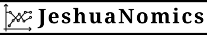

# Prefacio {-}

```{r, echo = F}
options(knitr.duplicate.label = "allow")
```

```{r, child="_setup.Rmd"}
```

```{r, eval=my_output == "html", echo=FALSE, results='asis'}
cat('<hr style="background-color:#03193b;height:2px">')
```

<center></center>

```{r, eval=my_output == "html", echo=FALSE, results='asis'}
cat('<hr style="background-color:#03193b;height:2px">')
```

<center></center>
<br><center></center>
<br><center><a href="https://www.jeshuanomics.com/" target="blank">Publicado por Jeshua Romero Guadarrama en colaboración con JeshuaNomics:</a></center>
<br><center><a href="https://github.com/JeshuaNomics" class="fa fa-github"><span class="label">  Git Hub</span></a>
<a href="https://www.facebook.com/JeshuaNomics/" class="fa fa-facebook"><span class="label">  Facebook</span></a>
<a href="https://twitter.com/JeshuaNomics" class="fa fa-twitter"><span class="label">  Twitter</span></a>
<a href="https://www.linkedin.com/in/jeshua-romero-guadarrama/" class="fa fa-linkedin"><span class="label">  Linkedin</span></a>
<a href="https://vk.com/jeshuanomics" class="fa fa-vk"><span class="label">  Vkontakte</span></a>
<a href="https://jeshuanomics.tumblr.com/" class="fa fa-tumblr"><span class="label">  Tumblr</span></a>
<a href="https://www.youtube.com/channel/UCY7f84mJGvMN7TF7XI4-Jgg?view_as=subscriber/" class="fa fa-youtube-play"><span class="label">  YouTube</span></a>
<a href="https://www.instagram.com/JeshuaNomics/" class="fa fa-instagram"><span class="label">  Instagram</span></a></center>

<br> Jeshua Romero Guadarrama es economista y actuario por la <a href="http://www.economia.unam.mx/">Universidad Nacional Autónoma de México</a>, quien ha construido el presente proyecto en colaboración con <a href="https://www.jeshuanomics.com">JeshuaNomics</a>, ubicado en la Ciudad de México, se puede contactar mediante el siguiente correo electrónico: jeshuanomics@gmail.com.
<br>
<br> `r sf <- lubridate::stamp_date('Última actualización el martes 21 del 05 de 2021'); sf(Sys.Date())`
<br>

```{r, eval=knitr::opts_knit$get("rmarkdown.pandoc.to") == "html", results='asis', echo=FALSE}
cat('<hr style="background-color:#03193b;height:2px">')
```

El presente texto nace al calor de las exigencias académicas por un análisis téroico alternativo del sistema económico, que permita a futuros economistas, interesados en la filosofía, entender la diversidad de teorías disponibles y la forma en que estás fueron construidas, los paradigmas que les dieron origen y a los que se tuvieron que enfrentar en algún momento. 

A partir de los años que he pasado detrás de innumerables libros (con el objetivo de gestar, buscar y probar nuevos conocimientos), ve la luz pública este trabajo, que fué creciendo y cambiando lentamente, empezando como apuntes de la universidad. Creo que ha alcanzado la madurez suficiente para ser compartido con el mundo. Con independencia de su valor intrínseco, tengo entendido que hace mucho tiempo que no se hacía una obra de este tipo (lo que ciertamente le corresponde al lector juzgar). 

El presente libro muestra los fundamentos ideológicos detrás del trabajo de cualquier economista, así como las perspectivas que han prevalecido en gran medida en los últimos dos siglos: liberalismo^[El liberalismo se inclinó originalmente hacia un laissez-faire sin trabas, luego hacia un papel más amplio del Estado en el sistema económico (bajo la influencia de la ideología socialista), luego nuevamente se ha apoyado en un enfoque individualista de las cuestiones de producción y distribución de riqueza; más recientemente, la irrealidad de este enfoque ha sido revelada por las crisis sistémicas, lo que sugiere nuevas reflexiones e incertidumbres sobre la coherencia del razonamiento económico con la idea liberal: una perspectiva institucional e histórica puede abrir nuevos espacios para la comprensión de una economía circular cooperativista. ], nacionalismo^[Se examinan las vicisitudes del nacionalismo económico, sus rasgos estatistas y proteccionistas, su declive y resurgimiento reciente, no quedando claro qué forma está tomando actualmente desde el punto de vista económico y político. Esto es particularmente oscuro en el caso de esa forma específica de nacionalismo llamada populismo (término que busca decirlo todo, pero al examinarlo con cuidado no dice nada en específico).] y socialismo^[El declive y la caída del materialismo histórico de Marx no pueden ocultar el contraste inherente de intereses entre los dos lados de un contrato laboral. El legado duradero del socialismo es la relevancia duradera y multiforme, desde una fuerza laboral acobardada hasta cuestiones ambientales, entre otros temas sociales en las economías modernas.]. Sobre la base y la fuerza de estas ideologías se han construido los sistemas actuales. Exploro las conexiones entre teoría y juicios de valor para identificar las premisas filosóficas detrás del razonamiento económico de economistas tan diversos como Smith, Ricardo, Marx, Pareto, Keynes, Hayek, entre otros.

Asimismo, el libro forma un camino idóneo para un estudio formal de los aspectos básicos de la complejidad económica, desde un enfoque interdisciplinario y fundamentado en ideas. Exponiendo la teoría de la complejidad y sus amplias aplicaciones en economía, política y otras disciplinas relacionadas^[Con aplicaciones en todas las disciplinas caracterizadas por sistemas adaptativos no lineales interconectados, como la ciencia económica o ciencias regionales, matemáticas, física, biología, ciencias ambientales, filosofía y psicología.]. Comienzo con una descripción completa de las categorías más amplias de complejidad en economía (dinámica, computacional, jerárquica y estructural) antes de pasar a un análisis más detallado. 

A continuación, abordo los problemas asociados con la complejidad computacional, especialmente los de computabilidad, y discuto el teorema de incompletitud de Godel con un enfoque en la reflexividad. En este mismo sentido, discuto la relación entre la entropía, la econofísica, la evolución y la complejidad económica, respectivamente, con aplicaciones en la dinámica urbana y regional, la economía ecológica, la teoría del equilibrio general y la dinámica del mercado financiero. Finalmente, reuno estos temas en un marco más amplio y expongo algunos de los límites relacionados con el análisis de cuestiones fundamentales más profundas.

#### Palabras clave {-}

- Filosofía económica
- Liberalismo clásico
- Nacionalismo económico
- Socialismo marxista
- Filosofía social
- Economía heterodoxa
- Filosofia politica
- Teoría económica clásica
- Iluminación
- Economía política
- Historicismo económico alemán
- Liberalismo económico
- El liberalismo de Keynes
- Corporativismo
- Historia de las ideas
- Complejidad económica 
- Teoría económica 
- Teorema de incompletitud de Gödel
- Reflexividad
- Dinámica del mercado
- Teoría del equilibrio
- Complejidad computacional
- Econofísica

#### Las convenciones usadas en el presente curso {-}

+ El texto *en cursiva* indica nuevos términos, nombres y similares.

+ El texto **en negrita** se usa generalmente en párrafos para referirse a conceptos que se recomienda memorizar. 

+ <code>Texto de ancho constante sobre fondo gris</code> indica un enfoque teórico o metodológico comúnmente utilizado en la práctica por los politólogos. 

#### Reconocimiento {-}

A mi alma máter: Universidad Nacional Autónoma de México (Facultad de Economía y Facultad de Ciencias). Por brindarme valiosas oportunidades que coadyuvaron a mi formación.

```{r, eval=knitr::opts_knit$get("rmarkdown.pandoc.to") == "html", results='asis', echo=FALSE}
cat('<br>


Esta obra está autorizado bajo la [Creative Commons Attribution-NonCommercial-ShareAlike 4.0 International License](http://creativecommons.org/licenses/by-nc-sa/4.0/).')
```

# Contenido {-}

Parte I Siglo XIX y Siglo XX

Capítulos:

- Ideologías y economía política en el siglo XIX
- Metamorfosis del liberalismo en el siglo XX

Parte II Entender el liberalismo y neoliberalismo

Capítulos:

- Enemigos del liberalismo
- Neoliberalismo

Parte III Visiones alternativas 

Capítulos:

- La filosofía económica desde mi perspectiva
- Alternativas
 
Parte IV Economía de la complejidad

Capítulos:

- Fundamentos lógicos y filosóficos de la complejidad
- Fundamentos de la economía conductual compleja

Parte V Complejidad de las interacciones sociales

Capítulos:

- La compleja dinámica de las interacciones sociales

Parte VI Econofísica, entropía, complejidad y sistemas

Capítulos:

- Econofísica, entropía y complejidad
- Econofísica y entropía en sistemas urbanos/regionales dinámicamente complejos

Parte VII Sistemas ecológicos complejos

Capítulos:

- Los sistemas ecológico-económicos complejos y sus problemas de gobernanza
- Complejidad y futuro de la economía

# Índice de contenido {-}

Capítulo 1. Ideologías y economía política en el siglo XIX

- Schumpeter: en el origen de la economía política
- Ilustración radical y moderada: Adam Smith y David Ricardo
- El positivismo y John Stuart Mill
- Utilidad marginal: Jevons y Marshall: ¿estamos en el campo del liberalismo?
- La economía como ciencia pura: Léon Walras y Vilfredo Pareto
- Historicismo: nacionalismo económico y socialismo marxista
- Alemania y Gran Bretaña en el siglo XIX
- La economía política como sistema de “economía nacional”
- Lista: proteccionistas, mercantilistas, fisiócratas y la idea de Europa
- Historicismo económico alemán
- Socialismo marxista

Capítulo 2. Metamorfosis del liberalismo en el siglo XX

- Causas del nuevo pensamiento sobre el liberalismo
- El estatismo de Rathenau frente al “liberismo” de Einaudi
- Las dudas de Pigou
- El liberalismo de Keynes
- Estado de bienestar de Beveridge
- La escuela austriaca y el liberalismo de Hayek
- La escuela de Chicago
- Ordoliberalismo o liberalismo autoritario

Capítulo 3. Enemigos del liberalismo

- Nacionalismo y corporativismo
- Diferentes interpretaciones del corporativismo
- Filosofía económica marxista después de Marx: sin cambios
- Ajustar e interpretar a Marx
- Crítica de Dobb a la economía de libre mercado. La reconciliación de Sraffa entre la economía clásica y el marxismo
- Crítica liberal del marxismo
- Socialismo por defecto: religión, Schumpeter y Polanyi

Capítulo 4. Neoliberalismo

- La “situación clásica” de Keynes
- Desaparición del consenso keynesiano
- Actitudes filosóficas: constitucionalismo económico
- Nueva economía clásica
- ¿ Una nueva “situación clásica?”
- El populismo como subproducto del neoliberalismo

Capítulo 5. La filosofía económica desde mi perspectiva

- Una visión liberal
- ¿Hacia dónde iría ahora un liberal?

Capítulo 6. Fundamentos lógicos y filosóficos de la complejidad

- Formas de complejidad
- Fundamentos de la economía de la complejidad computacional
- Epistemología y complejidad computacional
- Fundamentos de la economía de la complejidad dinámica
- Conocimiento y complejidad dinámica
- Conocimiento y ergodicidad
- Reflexividad y unificación de conceptos de complejidad
- Observaciones adicionales

Capítulo 7. Fundamentos de la economía conductual compleja

- Resumen
- Herbert Simon y la racionalidad limitada
- Imitación e inestabilidad de los mercados
- Complejidad jerárquica y la cuestión del surgimiento
- Racionalidad limitada y aprender a creer en el caos
- Economía del comportamiento e incertidumbre keynesiana
- Economía del comportamiento y la complejidad de la evolución institucional
- El debate de la discontinuidad en la teoría evolutiva
- Instituciones, organizaciones y el lugar de la evolución económica
- Emergencia y evolución multinivel
- Economía institucional antigua y nueva desde una perspectiva evolutiva compleja
- Resumiendo

Capítulo 8. La compleja dinámica de las interacciones sociales

- Introducción
- Rendimientos laborales en la economía no observada
- Variables y fuentes de datos
- Hallazgos empíricos
- Conclusiones

Capítulo 9. Econofísica, entropía y complejidad

- Los orígenes y la naturaleza de la econofísica
- El papel de la distribución de Pareto
- El papel de la mecánica estadística
- Econoquímica y Econobiología
- Econofísica y entropía
- Unidad de los conceptos centrales de la entropía
- La entropía ontológica y la econofísica como límite fundamental del crecimiento
- La entropía ontológica y la visión energética del valor económico
- Entropía metafórica y valor de equilibrio general
- Entropía entre econofísica y sociofísica
- Modelado financiero entrópico metafórico
- Más metáfora, el proceso anti-entrópico de la burbuja de Minsky
- Modelado de la dinámica de distribución de la riqueza y la renta mediante la mecánica estadística
- Rompiendo burbujas y la venganza de la entropía metafórica

Capítulo 10. Econofísica y entropía en sistemas urbanos/regionales dinámicamente complejos

- Observaciones iniciales
- El modelo de Wilson
- Variaciones en los modelos de distribución espacial entrópica
- Sistemas urbanos/regionales termodinámicamente sostenibles
- Procesos anti-entrópicos en sistemas urbanos/regionales
- Complejidad, entropía y autoorganización de sistemas urbanos/regionales
- Observaciones adicionales

Capítulo 11. Los sistemas ecológico-económicos complejos y sus problemas de gobernanza

- Introducción: Ostrom, complejidad y gobernanza
- Dinámica pesquera compleja
- Problemas de complejidad de la rotación óptima en los bosques
- Complejidades de los sistemas de economía climática
- Estabilidad, resiliencia, complejidad de los ecosistemas revisados ​​y políticas

Capítulo 12. Complejidad y futuro de la economía

- La evolución de la economía
- Más sobre la naturaleza de la complejidad
- ¿Qué es el trabajo de complejidad de vanguardia?
- Cambios en los métodos de investigación
- Trabajo de complejidad de vanguardia y macroeconomía moderna
- La economía de la complejidad y el debate sobre la economía heterodoxa
- Economía de la complejidad y políticas públicas
- La paradoja de la economía como sistema adaptativo complejo

Referencias bibliográficas